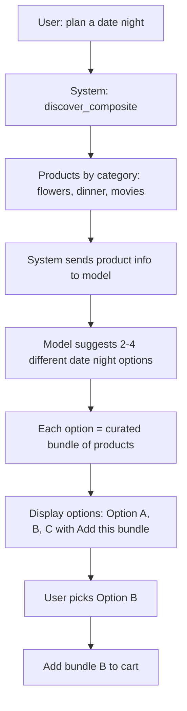

# Plan: Date Night – Multiple Bundle Options (User Picks)

> **Superseded by**: [composite-bundle-unified-plan.md](./composite-bundle-unified-plan.md) – all composite bundle plans are consolidated there.

## Overview

User asks "plan a date night". The system sends product info (all products or product categories) to the model. The model suggests **multiple options** for how the date night can be planned with the available products. The user **picks** one bundle option, and that bundle is added to their cart.

---

## User Flow



---

## Detailed Flow

### Step 1: User asks

- **Input**: "plan a date night" (or "plan a date night in SF", "date night $100 budget")
- **System**: Planner → resolve_intent → discover_composite
- **Output**: Categories with products (e.g. flowers: [Roses, Tulips], dinner: [Italian, Sushi], movies: [Comedy, Drama])

### Step 2: System sends product info to model

- **Input to model**: All products (or product categories) with id, name, price, category
- **Format**: Structured list per category so model knows what's available
- **Example**:
  ```
  Flowers: id=1 Red Roses $49, id=2 Tulips $35, id=3 Sunflowers $29
  Dinner: id=4 Italian $80, id=5 Sushi $60, id=6 Picnic basket $25
  Movies: id=7 Romantic Comedy $15, id=8 Live Jazz $40
  ```

### Step 3: Model suggests different options

- **Output**: 2–4 distinct "date night plans", each with:
  - **Label**: e.g. "Romantic Classic", "Adventure Night", "Budget-Friendly"
  - **Description**: Brief pitch (1–2 sentences)
  - **Product IDs**: [id1, id2, id3] for that option
- **Example**:
  ```
  Option A: Romantic Classic – Red Roses + Italian Dinner + Romantic Comedy [$144]
  Option B: Fresh & Fun – Tulips + Sushi + Live Jazz [$135]
  Option C: Casual Outdoors – Sunflowers + Picnic + Outdoor Movie [$69]
  ```

### Step 4: User picks a bundle

- **UI**: Each option shown as a card or button with "Add this bundle"
- **Action**: User clicks "Add this bundle" for Option B
- **System**: Calls add_bundle_bulk with product_ids from Option B

---

## Data Structures

### Model output (structured)

```json
{
  "options": [
    {
      "label": "Romantic Classic",
      "description": "Red roses, Italian dinner, and a romantic comedy.",
      "product_ids": ["uuid-1", "uuid-4", "uuid-7"],
      "total_price": 144.00
    },
    {
      "label": "Fresh & Fun",
      "description": "Tulips, sushi, and live jazz.",
      "product_ids": ["uuid-2", "uuid-5", "uuid-8"],
      "total_price": 135.00
    }
  ]
}
```

### Adaptive card payload (per option)

```json
{
  "action": "add_bundle_bulk",
  "product_ids": ["uuid-2", "uuid-5", "uuid-8"],
  "option_label": "Fresh & Fun"
}
```

---

## Implementation Plan

### Phase 1: LLM – Multiple Bundle Options

**1.1 New function: `suggest_composite_bundle_options()`**

- **File**: `services/orchestrator-service/agentic/response.py`
- **Replaces or extends**: `suggest_composite_bundle()` (single option) → new function returns multiple options
- **Input**: categories with products, user_message, experience_name, budget_max
- **Output**: `List[Dict]` – each option has `label`, `description`, `product_ids`, `total_price`
- **Prompt**: "Given these products, suggest 2–4 different ways to plan this experience. Each option picks one product per category. Return JSON: { options: [{ label, description, product_ids, total_price }] }"
- **Validation**: Only product IDs from the provided list; one product per category per option

**1.2 Loop integration**

- **File**: `services/orchestrator-service/agentic/loop.py`
- **Change**: Call `suggest_composite_bundle_options()` instead of `suggest_composite_bundle()`
- **Store**: `engagement_data["suggested_bundle_options"]` = list of options

### Phase 2: Experience Card – Multiple Options UI

**2.1 Update experience card**

- **File**: `packages/shared/adaptive_cards/experience_card.py`
- **Input**: `suggested_bundle_options: List[Dict]` (each option has label, description, product_ids)
- **Output**: For each option, add a section:
  - **Label** (e.g. "Romantic Classic")
  - **Description** (one line)
  - **Price** (total)
  - **Button**: "Add this bundle" → Action.Submit with `action: add_bundle_bulk`, `product_ids: [...]`
- **Layout**: Option A | Option B | Option C as separate cards or a horizontal choice set

**2.2 Card structure**

```
Your Date Night Bundle
─────────────────────
Option A: Romantic Classic – Red Roses + Italian + Comedy ($144)
[Add this bundle]

Option B: Fresh & Fun – Tulips + Sushi + Live Jazz ($135)
[Add this bundle]

Option C: Budget-Friendly – Sunflowers + Picnic + Movie ($69)
[Add this bundle]
─────────────────────
[Per-category product listings below, as today]
```

### Phase 3: Bulk Add API (unchanged from prior plan)

- Discovery: `add_products_to_bundle_bulk()`, `POST /bundle/add-bulk`
- Orchestrator: client + proxy
- Chat UI: handle `add_bundle_bulk` action

### Phase 4: Engagement Message

**4.1 Engagement text**

- **File**: `services/orchestrator-service/agentic/response.py` – `_build_context` for discover_composite
- **Add**: When `suggested_bundle_options` present, include in context: "We've suggested 3 date night options. Each option is a curated bundle. User can add any option with one click."
- **Engagement message**: "I've put together 3 date night options for you – Romantic Classic, Fresh & Fun, and Budget-Friendly. Pick the one that fits your style, or mix and match from the products below."

---

## Product Info Format

### Option A: Full product list (all products)

- Send every product with id, name, price, category
- **Pros**: Model has full context
- **Cons**: Token-heavy if many products

### Option B: Product categories (top N per category)

- Send top 3–5 products per category
- **Pros**: Keeps token count manageable
- **Cons**: Model might miss good combinations

**Recommendation**: Option B – top 3–5 per category. Enough variety for 2–4 distinct options without token overflow.

---

## Implementation Order

1. **suggest_composite_bundle_options()** – returns multiple options
2. **Loop** – call it, store `suggested_bundle_options`
3. **Experience card** – render multiple options with "Add this bundle" per option
4. **Bulk add API** – Discovery + Orchestrator + Chat UI
5. **Engagement context** – include options in engagement message

---

## Differences from Single-Option Plan

| Aspect | Single option (current) | Multiple options (this plan) |
|--------|-------------------------|------------------------------|
| Model output | 1 list of product_ids | 2–4 options, each with label, description, product_ids |
| User choice | Add curated bundle or add individually | Pick one option, then add |
| Card UI | One "Add curated bundle" button | One "Add this bundle" per option |
| Engagement | "Here's your curated bundle" | "Here are 3 ways to plan your date night" |

---

## Migration from Existing Code

- **suggest_composite_bundle()** → rename or replace with `suggest_composite_bundle_options()`
- **Return type**: `List[str]` → `List[Dict]` with `label`, `description`, `product_ids`, `total_price`
- **Experience card**: `suggested_bundle_product_ids` → `suggested_bundle_options` (list of option dicts)

---

## Files to Modify

| File | Change |
|------|--------|
| `agentic/response.py` | Add `suggest_composite_bundle_options()` (or replace existing) |
| `agentic/loop.py` | Call new function, store `suggested_bundle_options` |
| `adaptive_cards/experience_card.py` | Accept `suggested_bundle_options`, render multiple "Add this bundle" |
| `discovery-service/db.py` | `add_products_to_bundle_bulk()` |
| `discovery-service/api/products.py` | `POST /bundle/add-bulk` |
| `orchestrator-service/clients.py` | `add_to_bundle_bulk()` |
| `orchestrator-service/api/products.py` | `POST /bundle/add-bulk` |
| `uso-unified-chat` | Handle `add_bundle_bulk` action |
