# Plan: Using LLM to Suggest Engagement: Composite Bundle

> **Superseded by**: [composite-bundle-unified-plan.md](./composite-bundle-unified-plan.md) – all composite bundle plans are consolidated there.

## Overview

When a user asks for a composite experience (e.g. "date night", "birthday party"), the system discovers products per category (flowers, dinner, movies). Today users add products one-by-one via "Add to Bundle". This plan adds **LLM-curated bundle suggestion**: the model picks one product per category, and the user can add the whole curated bundle with one click.

---

## Current State

### Already Implemented (partial)

| Component | Status | Location |
|-----------|--------|----------|
| `suggest_composite_bundle()` | Done | `services/orchestrator-service/agentic/response.py` |
| Loop integration | Done | `services/orchestrator-service/agentic/loop.py` – calls after discover_composite |
| Experience card "Add curated bundle" button | Done | `packages/shared/adaptive_cards/experience_card.py` – Action.Submit with `action: add_bundle_bulk` |

### Not Yet Implemented

| Component | Status | Notes |
|-----------|--------|-------|
| Bulk add API | Pending | Discovery service + orchestrator proxy |
| Chat UI handler for `add_bundle_bulk` | Pending | Unified chat must handle the action |

---

## Architecture

```mermaid
flowchart TD
    subgraph UserFlow [User Flow]
        A[User: plan date night] --> B[Planner: discover_composite]
        B --> C[Categories: flowers, dinner, movies]
        C --> D[suggest_composite_bundle]
        D --> E[LLM picks 1 product per category]
        E --> F[Experience card with Add curated bundle]
        F --> G[User clicks Add curated bundle]
        G --> H[add_bundle_bulk API]
        H --> I[Bundle created with all products]
    end

    subgraph Backend [Backend]
        D
        H
    end
```



---

## Implementation Plan

### Phase 1: Bulk Add API (Discovery + Orchestrator)

**1.1 Discovery service – DB layer**

- **File**: `services/discovery-service/db.py`
- **Add**: `add_products_to_bundle_bulk(product_ids: List[str], user_id: Optional[str], bundle_id: Optional[str]) -> Optional[Dict]`
- **Logic**: Create bundle with first product; add remaining products via existing `add_product_to_bundle` pattern. Return `{bundle_id, products_added, total_price, currency}`.
- **Reuse**: Existing `add_product_to_bundle` logic; loop over product_ids.

**1.2 Discovery service – API**

- **File**: `services/discovery-service/api/products.py`
- **Add**: `AddBulkBody` (product_ids: List[str], user_id?, bundle_id?)
- **Add**: `POST /bundle/add-bulk` → calls `add_products_to_bundle_bulk`

**1.3 Orchestrator proxy**

- **File**: `services/orchestrator-service/clients.py`
- **Add**: `add_to_bundle_bulk(product_ids, user_id?, bundle_id?)` → calls Discovery `/bundle/add-bulk`
- **File**: `services/orchestrator-service/api/products.py`
- **Add**: `POST /bundle/add-bulk` → proxies to Discovery

---

### Phase 2: Chat UI Handler

**2.1 Unified Chat – action handler**

- **File**: `apps/uso-unified-chat/components/AdaptiveCardRenderer.tsx` (or equivalent)
- **Current**: Handles `add_to_bundle`, `view_details`, `view_bundle`, etc.
- **Add**: Handle `add_bundle_bulk` – when `action === "add_bundle_bulk"` and `product_ids` present:
  - Call `POST /api/bundle/add-bulk` (or proxy to orchestrator)
  - Body: `{ product_ids, user_id?, bundle_id? }`
  - On success: show bundle summary or refresh; optionally show View Bundle card.

**2.2 Portal / embed**

- If the embed or other chat UIs render experience cards, add the same `add_bundle_bulk` handler.

---

### Phase 3: Optional Enhancements

| Enhancement | Description |
|-------------|-------------|
| **Configurable** | Platform config flag to enable/disable LLM bundle suggestion (e.g. `enable_composite_bundle_suggestion`) |
| **Model interaction prompt** | Add `suggest_composite_bundle` to model_interaction_prompts so admins can tune the curation prompt |
| **Fallback** | If LLM fails, use first product per category as default curated set |
| **Budget enforcement** | Pass `budget_max` to LLM; filter suggested products by total price |

---

## Data Flow

### Experience card payload (Add curated bundle)

```json
{
  "action": "add_bundle_bulk",
  "product_ids": ["uuid-1", "uuid-2", "uuid-3"]
}
```

### Bulk add request

```json
POST /api/v1/bundle/add-bulk
{
  "product_ids": ["uuid-1", "uuid-2", "uuid-3"],
  "user_id": "optional",
  "bundle_id": "optional"
}
```

### Response

```json
{
  "bundle_id": "uuid",
  "products_added": ["Product A", "Product B", "Product C"],
  "total_price": 125.00,
  "currency": "USD"
}
```

---

## Dependencies

- Orchestrator has LLM configured (for `suggest_composite_bundle`)
- Discovery service has Supabase (bundles, bundle_legs, products)
- Unified chat has `ORCHESTRATOR_URL` for API proxy

---

## Risks and Mitigations

| Risk | Mitigation |
|------|------------|
| LLM returns invalid product IDs | Validate against `valid_ids` set; only accept IDs from discovery result |
| LLM fails or times out | Return empty list; card shows no "Add curated bundle" button; user can still add individually |
| Adaptive Card `product_ids` array serialization | Ensure Action.Submit sends array correctly; some renderers may need JSON.stringify |
| Duplicate products in bundle | Bulk add should add each product once; existing add logic handles duplicates per leg |

---

## Testing Steps

1. **Discovery bulk add API**: `curl -X POST $DISCOVERY/api/v1/bundle/add-bulk -H "Content-Type: application/json" -d '{"product_ids":["id1","id2"]}'`
2. **Orchestrator proxy**: Same via `$ORCHESTRATOR/api/v1/bundle/add-bulk`
3. **End-to-end**: Chat "plan a date night" with budget → verify "Add curated bundle" appears → click → verify bundle created with one product per category
4. **Fallback**: Disable LLM or use invalid key → verify no "Add curated bundle" button; per-product Add to Bundle still works

---

## Files to Modify (Summary)

| Phase | File | Change |
|-------|------|--------|
| 1.1 | `services/discovery-service/db.py` | Add `add_products_to_bundle_bulk()` |
| 1.2 | `services/discovery-service/api/products.py` | Add `AddBulkBody`, `POST /bundle/add-bulk` |
| 1.3 | `services/orchestrator-service/clients.py` | Add `add_to_bundle_bulk()` |
| 1.3 | `services/orchestrator-service/api/products.py` | Add `AddBulkBody`, `POST /bundle/add-bulk` |
| 2.1 | `apps/uso-unified-chat` (AdaptiveCardRenderer or action handler) | Handle `add_bundle_bulk` action |

---

## Implementation Order

1. Discovery: `add_products_to_bundle_bulk` in db.py
2. Discovery: `POST /bundle/add-bulk` in api/products.py
3. Orchestrator: client + proxy for `/bundle/add-bulk`
4. Unified chat: handle `add_bundle_bulk` action
