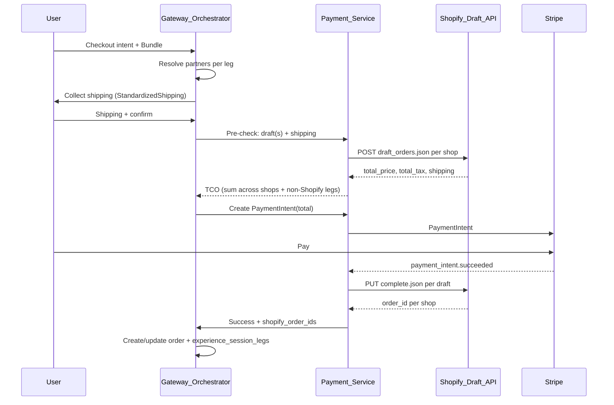
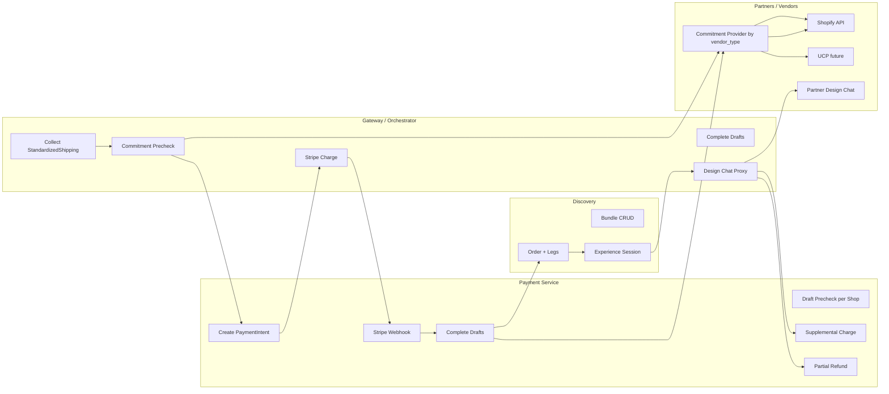

# Commitment-First Orchestration for USO

## Current state (brief)

- **Checkout**: Bundle → Discovery `create_order_from_bundle` → one `orders` row + `order_legs` → Payment service creates single Stripe PaymentIntent for order total; no Shopify draft in the main path.
- **Shopify**: [shopify_draft.py](services/payment-service/shopify_draft.py) has `create_draft_order_precheck` and `complete_draft_order`; [checkout.py](services/payment-service/api/checkout.py) exposes `/shopify-draft/precheck` and `/shopify-draft/complete`. Not wired into the primary checkout flow.
- **Shipping**: [StandardizedShipping](packages/shared/schemas.py) exists and converts to Shopify `shipping_address`; not collected at Gateway in a single place before payment.
- **Experience sessions**: [experience_sessions.sql](supabase/migrations/20250129000001_experience_sessions.sql) — `experience_session_legs` with statuses `pending` / `ready` / `in_customization` / `committed`; `shopify_draft_order_id` on leg. No `allows_modification`, no link from `payments` to experience_session.
- **Vendor types:** Today only Shopify has commitment flow (draft orders). Registry has `transport_type` (UCP/MCP/SHOPIFY); no shared “commitment provider” abstraction yet.
- **Re-sourcing**: [recovery_orchestrator.py](services/re-sourcing-service/recovery_orchestrator.py) handles partner rejection (cancel leg, find alternative, add to bundle/order). No SLA timeout; no Shopify order cancel/place-new.
- **Metadata enricher**: [metadata_enricher.py](services/discovery-service/middleware/metadata_enricher.py) already enriches products missing `experience_tags` via LLM (batch 5, allowed tags); used in [scout_engine.py](services/discovery-service/scout_engine.py) before ranking. Shopify/MCP products get in-memory enrichment.
- **Partner flags**: `internal_agent_registry.available_to_customize` exists; no `allows_modification` or per-partner `sla_response_hours`.

---

## 1. Hybrid customization

**Goal:** User can buy from one partner and choose to customize with a different partner.

**Approach:**

- Keep bundle/order as today: each leg has a **selling** `partner_id` (and product). No schema change for “who sold.”
- Add optional **customization partner** for the session or per leg:
  - Add `customization_partner_id` to `experience_session_legs` so different legs can have different design partners.
- When moving to design phase (see §4), if `customization_partner_id` is set, route Design Chat to that partner; otherwise use the selling partner for that leg (if `available_to_customize`).
- **Discovery/UI:** After payment, if config allows “choose customizer,” show a small step or chat choice: “Customize with [Selling Partner] or [Partner B]” and set `customization_partner_id` before starting design chat.

**Files to touch:** Migration (experience_sessions or experience_session_legs), Discovery API for experience-sessions, orchestrator/chat flow when transitioning to design, portal if we expose customization partner choice.

---

## 2. Pre-customization payment flow

**Goal:** Collect shipping at Gateway → **vendor-agnostic** commitment precheck (tax/shipping) → single Gateway (Stripe) charge → on success **commit** per vendor to secure inventory. **First implementation: Shopify** (draft orders + complete.json); design must allow **UCP or other vendor types** to plug in later without changing Gateway or payment flow.

**2.1 StandardizedShipping at Gateway**

- **Orchestrator** (or unified chat): Before calling payment pre-check, collect shipping using [StandardizedShipping](packages/shared/schemas.py) (name, address, phone, email). Already has `to_shopify_shipping_address()`.
- Add a dedicated “shipping collection” step in the checkout flow (e.g. fulfillment modal already used for add_bundle_bulk). Ensure one canonical place (e.g. `thread_context.fulfillment_context.shipping` or a new `checkout_shipping` in context) so payment-service can receive it.

**2.2 Tax pre-check (draft mode) — vendor-extensible**

- **Payment-service** (or a new “commitment” module):
  - New endpoint e.g. `POST /api/v1/commitment/precheck`: input = `bundle_id` (or list of line items per partner) + **StandardizedShipping** + optional `thread_id`/`user_id`.
  - **Commitment provider abstraction:** For each leg/partner, resolve **vendor type** (e.g. from `internal_agent_registry.transport_type` or partner config). Call the **commitment provider** for that type:
    - **Shopify (first implementation):** Get credentials via [get_shopify_partner_credentials](services/payment-service/shopify_draft.py), build `line_items` from bundle_legs for that partner, call `create_draft_order_precheck(shop_url, access_token, line_items, shipping_address, email)`. Return `reservation_id` (draft_order_id), `total_price`, `total_tax`, `currency`.
    - **UCP / others (future):** Implement same interface: `precheck(partner_id, line_items, shipping) → { reservation_id, total_price, total_tax?, shipping?, currency }`. No Shopify-specific logic in the orchestrator or webhook.
  - For legs with no external vendor (e.g. local DB only), use a “local” provider that returns a fixed or zero tax/shipping total.
  - Return **TCO**: `total_amount`, `currency`, `breakdown`: `{ per_leg_or_shop: { vendor_type, reservation_id, total_price, total_tax }, local_total }`, and persist `reservation_id` per leg (e.g. in experience_session_legs as `external_reservation_id` or keep `shopify_draft_order_id` for Shopify and add generic `vendor_type`).
- **Discovery** may need to expose “bundle by id with legs and partner” so payment-service can group by vendor/partner.

**2.3 Gateway charge**

- After precheck, **orchestrator** calls existing `create_payment_intent` (or equivalent) with the **TCO total** (sum of Shopify draft totals + local total). Optionally store `precheck_id` or `draft_order_ids` in Stripe metadata so webhook can complete drafts.
- Frontend: unchanged — confirm PaymentIntent with Stripe.js.

**2.4 Handshake (complete after payment) — vendor-extensible**

- **Stripe webhook** (`payment_intent.succeeded`): In addition to updating order payment status, detect “commitment” flow (e.g. metadata has `commitment_precheck_id` or per-leg reservation ids). For each leg with a reservation:
  - Resolve **commitment provider** by vendor type (e.g. `shopify`, `ucp`). Call provider’s **complete(reservation_id, payment_pending=False)**:
    - **Shopify:** Call `complete_draft_order(..., payment_pending=False)` with the correct shop credentials; return `order_id`.
    - **UCP (future):** Call UCP’s commit/confirm endpoint with reservation id; return external order reference.
  - Store returned **external order id** on the leg. Use a vendor-agnostic column **external_order_id** (TEXT) plus **vendor_type** (e.g. `shopify`, `ucp`) so the same schema supports any vendor. (Keep or map from `shopify_order_id` for backward compatibility if needed.)
- **Order creation timing:** Either (a) create `orders`/`order_legs` before precheck (and update with external_order_id after complete), or (b) create order only after successful payment + complete. (a) is easier for existing flows. Prefer (a) with order status `pending_payment` until handshake completes.

**Files:** [payment-service/shopify_draft.py](services/payment-service/shopify_draft.py) (Shopify implementation); new **commitment provider** interface and registry (e.g. `CommitmentProvider`: precheck, complete; `get_provider(vendor_type)`); [payment-service/api/checkout.py](services/payment-service/api/checkout.py), new commitment precheck endpoint and webhook changes; [stripe_adapter.py](services/payment-service/stripe_adapter.py) metadata; orchestrator checkout flow and fulfillment collection; migration for **external_order_id** + **vendor_type** (and optionally **external_reservation_id**) on experience_session_legs.

---

## 2.5 Vendor extensibility (commitment provider abstraction)

**Principle:** All vendor-specific behavior (Shopify draft orders, UCP reserve/commit, future providers) lives behind a **commitment provider** interface. Gateway, payment-service webhook, re-sourcing, and AERD call this interface; they never branch on `if vendor == 'shopify'` outside the provider implementation.

**Suggested interface (implement in payment-service or a shared package):**

- **Precheck:** `precheck(partner_id, vendor_type, line_items, shipping_address, ...) → { reservation_id, total_price, total_tax?, shipping?, currency }`. Shopify: create draft order, return draft id. UCP: call partner’s reserve/TCO endpoint.
- **Complete:** `complete(partner_id, vendor_type, reservation_id, payment_pending=False) → { external_order_id }`. Shopify: PUT complete.json. UCP: confirm order with partner.
- **Cancel:** `cancel(partner_id, vendor_type, external_order_id) → ok`. Shopify: cancel order/draft via Admin API. UCP: cancel via partner API.
- **Place (for re-sourcing):** Same as precheck + charge + complete for a single leg; used when switching to an alternative partner. Provider is selected by the **new** partner’s vendor_type.

**Registry:** Resolve vendor_type from `internal_agent_registry.transport_type` or a dedicated `commitment_vendor_type` (e.g. `SHOPIFY`, `UCP`, `LOCAL`). Map to provider implementation (e.g. ShopifyCommitmentProvider, UCPCommitmentProvider). Add new vendor by implementing the interface and registering; no changes to orchestration or webhook flow.

**Schema:** Use **external_order_id** and **external_reservation_id** (TEXT) plus **vendor_type** (VARCHAR) on experience_session_legs (and order_legs if needed) so any vendor can store its reference. Keep `shopify_draft_order_id` only if backward compatibility requires it; otherwise migrate to external_reservation_id + vendor_type.

---

## 3. Customize bundle before placing order

**Goal:** User can change products (search different, delete, replace) before committing to pay — **both via chat (natural language) and via UI actions** (Remove/Replace buttons).

**Approach:**

- **Chat-driven edits (first-class):** Users must be able to edit the bundle by typing in chat, for example:
  - **Remove a category/leg:** “No limo”, “skip the flowers”, “remove the transport”, “I don’t want the cake.”
  - **Replace with different product:** “Find a different color cap”, “swap the flowers for tulips”, “different restaurant”, “something cheaper for the dinner.”
  - **Refinements:** “Blue instead of red”, “bigger size”, “without nuts.”
  The agentic loop must treat these as **bundle-edit intents**: resolve intent (e.g. remove_leg, replace_leg, refine_leg), map to the current bundle (which leg/category), then call **remove_from_bundle** or **replace_product_in_bundle** (with discover_products for the new query/criteria). Planner and response prompts should explicitly list examples like “No limo”, “find different color cap”, “swap X for Y” so the model calls the right tools and does not just reply with text. After a chat-driven edit, confirm in chat (“Removed limo” / “Replaced with [product]. Here’s your updated bundle.”) and optionally re-show the bundle card or TCO.
- **Bundle mutability:** Discovery already supports add/remove/replace at bundle level ([db.py](services/discovery-service/db.py) — add_product_to_bundle, remove_from_bundle, replace_product_in_bundle). Orchestrator exposes these via [clients](services/orchestrator-service/clients.py) and [api/products](services/orchestrator-service/api/products.py).
- **UI + chat:** Before “Place order” / “Pay”, users can also use **Remove** / **Replace** buttons on the bundle card (see §3.1). Re-run “precheck” after any bundle change (from chat or UI) so TCO and draft orders stay in sync (or invalidate draft and recreate on next precheck).
- **No new tables:** Use existing bundle + tools; add clear prompts in planner/response so the model recognizes chat-driven edit intents and calls replace/remove tools; surface “View bundle” and optional “Review bundle” step before payment.

**3.1 UX changes required for bundle edits**

- **Chat-first:** Edits via chat (“No limo”, “find different color cap”) and via UI (Remove/Replace buttons) must both call the same remove/replace APIs and, after the edit, confirm in chat and optionally re-show the bundle card or summary so the user sees the updated bundle before proceeding to payment.
- **uso-unified-chat:** Already supports bundle edits when the bundle is shown as an Adaptive Card: [bundle_card.py](packages/shared/adaptive_cards/bundle_card.py) has per-item **Remove** and card-level **Proceed to Checkout** / **Add More**; [ChatPage.tsx](apps/uso-unified-chat/components/ChatPage.tsx) handles `remove_from_bundle` and `replace_in_bundle` in handleAction. Gaps to close for Commitment-First:
  - Ensure **View bundle** (and **Edit Order** from checkout card) surfaces the bundle Adaptive Card **before** payment so users see Remove and can edit. If checkout flow currently skips the bundle card, add an explicit “Review bundle” step that shows the bundle card (with Remove) and a “Proceed to payment” CTA after optional edits.
  - **Replace** today is triggered by the refinement card (backend sends alternatives when user says “swap X” or similar). Consider adding a per-item **Replace** button on the bundle card that calls an endpoint or sends a synthetic message to fetch alternatives for that leg/category and then shows the refinement card (or inline alternatives) so users can replace without typing.
- **assistant-ui-chat:** [BundleViewCard](apps/assistant-ui-chat/app/page.tsx) is **read-only** (items + total, no actions). UX changes needed:
  - Add **Remove** (and optionally **Replace**) per item when showing the bundle, **or** render the Adaptive Card returned by the view_bundle API (so Remove/Replace from [bundle_card](packages/shared/adaptive_cards/bundle_card.py) work). If the app does not render Adaptive Cards with Action.Submit, implement explicit buttons that call remove_from_bundle / replace_in_bundle (e.g. Remove → POST bundle/remove with item_id; Replace → request alternatives then show picker and POST bundle/replace).
  - Ensure **view_bundle** is offered before checkout (e.g. from engagement CTAs or after “Add to bundle”) so users can open the bundle and edit.
- **Pre-checkout “Review bundle” (optional but recommended):** In the Commitment-First flow, add a clear step before payment: “Review your bundle” (or “Confirm and pay”) that shows (1) bundle contents with Remove/Replace, (2) shipping summary, (3) TCO from commitment precheck, (4) “Proceed to payment.” That makes it obvious that users can edit before paying and avoids accidental checkout with the wrong bundle.

**Files:** [agentic/loop.py](services/orchestrator-service/agentic/loop.py), [agentic/planner.py](services/orchestrator-service/agentic/planner.py) (recognize chat-driven edit intents: remove leg, replace leg, refine; examples “No limo”, “find different color cap”), [agentic/tools.py](services/orchestrator-service/agentic/tools.py) (ensure replace/remove are exposed and used), [agentic/response.py](services/orchestrator-service/agentic/response.py) (prompts that steer model to call remove/replace tools for such messages; confirm edits in chat); [packages/shared/adaptive_cards/bundle_card.py](packages/shared/adaptive_cards/bundle_card.py) (optional per-item Replace); [apps/uso-unified-chat/components/ChatPage.tsx](apps/uso-unified-chat/components/ChatPage.tsx) (ensure View bundle / Edit Order shows bundle card before payment; optional “Review bundle” step); [apps/assistant-ui-chat/app/page.tsx](apps/assistant-ui-chat/app/page.tsx) and [GatewayPartRenderers.tsx](apps/assistant-ui-chat/components/GatewayPartRenderers.tsx) (add Remove/Replace to bundle view or render bundle Adaptive Card).

---

## 4. Post-order design management

**Goal:** After order is placed, set leg to `in_customization` when partner has `available_to_customize`; pipe WhatsApp/SMS to partner via startDesignChat; support AERD (Add/Edit = supplemental charge; Replace/Delete = cancel leg + partial refund).

**4.1 State transition**

- After payment + Shopify handshake (and optionally after “order placed” notification): For each experience_session_leg whose partner has `available_to_customize` (from [internal_agent_registry](supabase/migrations/20250129000000_hybrid_registry_shopify.sql)), set leg status to **in_customization** (or keep `ready` until design chat actually starts — see “Point of No Return” below).
- Discovery API: extend [experience_sessions](services/discovery-service/api/experience_sessions.py) / db to support “transition legs to in_customization” when order is paid and partner supports it.

**4.2 Design chat proxy (startDesignChat)**

- **Protocol:** “startDesignChat” is not present in codebase; define it as: Gateway receives an incoming message (WhatsApp/SMS) for `thread_id` → resolve `experience_session` by thread_id → find leg(s) in `in_customization` (and optionally customization_partner_id) → forward message to partner’s design-chat endpoint with **headless context**.
- **Headless context:** Include in every request to partner:
  - `order_id` (USO order id),
  - **external_order_id** (vendor’s order reference; e.g. Shopify order id when vendor_type is shopify) so partner can look up the order in their system,
  - **USO intent summary** (e.g. last intent narrative or a short “Experience: Date Night; User asked for romantic dinner + flowers”) so partner doesn’t ask “What did you buy?”
- **Implementation:** Add a Gateway route or middleware: when message comes in and session has leg in_customization, POST to partner’s `design_chat_url` (new config on partner or internal_agent_registry) with body `{ order_id, external_order_id, vendor_type, intent_summary, user_message, thread_id }`. Partner responds; Gateway sends response back to user. Store `design_chat_url` (or `start_design_chat_endpoint`) in partner/registry config.

**4.3 Modification logic (AERD) — vendor-extensible**

- **Add/Edit (upsell):** When user adds an item or edits (e.g. “make it gold-leaf”) during design chat:
  - Calculate price difference (new line or price change).
  - Create a **supplemental** Stripe PaymentIntent for that amount; link to **experience_session** (see §7).
  - On success, create new order_item/order_leg and/or call the **commitment provider** for that leg’s vendor type to add a line to the external order if supported (e.g. Shopify: add line to order; UCP: partner-specific upsell endpoint); update bundle.
- **Replace/Delete:** When user replaces a product or removes a leg:
  - **Cancel external order:** Call **commitment provider** `cancel(partner_id, vendor_type, external_order_id)` so the vendor cancels the order or line (Shopify: cancel order/draft; UCP: partner cancel API). Then cancel our order_leg in DB.
  - **Partial refund:** Use Stripe Refund API to refund the amount for that leg (link refund to original payment_intent or to a new “refund” record). Re-sourcing service already has [cancel_order_leg](services/re-sourcing-service/db.py); extend to call provider.cancel and Stripe refund when in “design” context.
- **Linking:** Payments need to support “supplemental” and link to experience_session (see §7).

**Files:** Discovery db (experience_session_leg status update, get legs by thread); orchestrator or gateway service (design chat proxy, headless context builder); payment-service (supplemental PaymentIntent, refund); re-sourcing or shared “order modification” module (cancel Shopify leg + refund); partner registry migration for design_chat_url / start_design_chat_endpoint.

---

## 5. Automatic re-sourcing and SLAs

**Goal:** If partner does not start design chat within `sla_response_hours`, **first notify the user** and **wait for a response**. **Only if the user agrees and similar alternatives are available**, then cancel the original order and place the new order with the alternative partner.

**5.1 Schema**

- Add **sla_response_hours** (numeric) to partner/registry (e.g. `internal_agent_registry` or `shopify_curated_partners`). Default e.g. 24.
- Add **design_started_at** (timestamptz, nullable) to `experience_session_legs` to record when partner actually started the design chat (so we can enforce “Point of No Return” and SLA).
- Add **re_sourcing_state** (e.g. TEXT or JSONB) to `experience_session_legs` or a small table **sla_re_sourcing_pending**: when we have notified the user but not yet acted, store state `awaiting_user_response` and optionally a snapshot of **similar alternatives** (e.g. list of partner_id + product_id or summary) so we don’t re-query Discovery on every message.

**5.2 SLA job: notify only (no auto-place)**

- **Scheduler/cron** (in Gateway, re-sourcing service, or task-queue): Periodically (e.g. every 15 min) find legs where:
  - status = `ready` (or `in_customization` if we start clock when leg enters that state),
  - partner has `available_to_customize` and `sla_response_hours` set,
  - order is placed (payment succeeded),
  - `design_started_at` is NULL and leg `created_at` (or order `paid_at`) + sla_response_hours < now,
  - and **re_sourcing_state** is not already `awaiting_user_response` (avoid duplicate notifications).
- **Do not cancel or place a new order yet.** Instead:
  1. **Find similar alternatives** via Discovery (same category/query, exclude current partner, similar experience_tags if possible). If none found, skip re-sourcing for this leg (optionally notify user “Partner A is delayed; we’re looking into it” without offering a switch).
  2. If similar alternatives exist: **Notify the user** in their thread (e.g. inject assistant message / adaptive card): “Partner A hasn’t started your design yet. We found similar options from Partner B (and optionally others). Would you like us to switch your order to Partner B?” with clear Yes / No (or “Switch” / “Keep waiting”) actions.
  3. Set **re_sourcing_state = awaiting_user_response** and store the chosen alternative(s) (e.g. best alternative partner_id, product_id, or list) in the pending record so the next step can use it without re-calling Discovery.

**5.3 User response: then place order only if confirmed**

- **Chat / intent handling:** When the user sends a message on the same thread and the session has a leg in **re_sourcing_state = awaiting_user_response**:
  - Resolve intent (e.g. “yes”, “switch”, “no”, “keep waiting”). Use existing intent resolution or a simple keyword/button match for “Switch to Partner B” / “No, keep my current order.”
  - **If user confirms (yes / switch) and we have stored similar alternatives:**
    - Run the **re-sourcing execution**: cancel Shopify order for that leg (Shopify cancel API), cancel our order_leg, add the alternative to bundle and order via Discovery, place new Shopify order for the new partner (draft precheck + charge + complete), update experience_session_leg with new partner/product and clear re_sourcing_state.
    - Notify user: “Your experience has been moved to Partner B. You can continue customizing with them.”
  - **If user declines (no / keep waiting):** Clear or leave re_sourcing_state so we don’t prompt again immediately; optionally schedule a follow-up reminder or leave leg as-is for manual handling.
- **Similar alternatives:** Use the same Discovery criteria as today’s re-sourcing (query from original intent/category, exclude current partner, limit e.g. 3–5). Only present the switch option when at least one similar alternative exists; do not auto-place without user confirmation.

**5.4 Re-sourcing execution (vendor-extensible)**

- [recovery_orchestrator.py](services/re-sourcing-service/recovery_orchestrator.py) today: cancel_order_leg, discover_products, add_product_to_bundle, add_order_item_and_leg. Extend to:
  - **Cancel external order:** Call **commitment provider** `cancel(partner_id, vendor_type, external_order_id)` for the leg being replaced (Shopify: cancel order/draft via Admin API; UCP: partner cancel). Use `external_order_id` and `vendor_type` from experience_session_leg or order_leg. Then cancel our order_leg in DB.
  - **Place new order:** For the **alternative** partner, resolve vendor_type and call the same commitment flow as checkout: provider **precheck** → Gateway charge (or dedicated “reserve + charge” for one leg) → provider **complete**. So inventory is secured for the new partner regardless of vendor type (Shopify: draft + complete; UCP: reserve + confirm when implemented).
- This execution runs **only** after the user has confirmed the switch in §5.3, not automatically when SLA is exceeded.
- Adding a new vendor type (e.g. UCP) requires implementing the commitment provider interface only; no changes to recovery_orchestrator control flow.

**Files:** Migration (sla_response_hours, design_started_at, re_sourcing_state or sla_re_sourcing_pending table); [re-sourcing-service](services/re-sourcing-service/) (recovery_orchestrator, db, clients for Shopify cancel + place); new SLA cron/job that only finds legs and sends notification + stores pending state; orchestrator/chat handler to detect user confirmation and call re-sourcing execution; Discovery/payment-service for “place order for one leg” if needed.

---

## 6. Metadata enricher

**Goal:** Intercept all incoming Shopify/MCP products; if they lack experience_tags, use a lightweight LLM to generate “vibe” tags.

**Current state:** [metadata_enricher.py](services/discovery-service/middleware/metadata_enricher.py) already:

- Runs from [scout_engine.py](services/discovery-service/scout_engine.py) after fetch (aggregator + semantic) and before ranking.
- Uses `_needs_enrichment(p, source)` (no/empty experience_tags, has description); batches 5 products; uses platform LLM; for Shopify/external, in-memory only.

**Enhancement:**

- Ensure **all** paths that bring Shopify/MCP products into discovery run through the same pipeline that calls `enrich_products_middleware`. Today aggregator → scout_engine → enrich → rank; confirm no bypass (e.g. direct product cards from MCP that skip scout).
- Optionally: add an explicit “intercept” at the aggregator or MCP driver layer that enriches immediately after fetching from Shopify/MCP, so even ad-hoc product lists (e.g. getProduct) get tags. Minimal change: call existing `enrich_products()` in the code path that returns Shopify/MCP products to the orchestrator.

**Files:** [scout_engine.py](services/discovery-service/scout_engine.py), [discovery_aggregator.py](packages/shared/discovery_aggregator.py) or [shopify_mcp_driver.py](packages/shared/shopify_mcp_driver.py) — ensure single place for “incoming Shopify/MCP → enrich → return.”

---

## 7. Crucial considerations

**7.1 Modification window (Point of No Return)**

- Add **allows_modification** (boolean, default true) to `experience_session_legs`. When the partner (or our proxy) signals “design started” (e.g. partner started the customized letter or baking), set **allows_modification = false** for that leg.
- **Design started:** Either partner calls a Gateway endpoint “design_started” with leg_id, or our Design Chat proxy detects first substantive message from partner and sets it. Then:
  - AERD Replace/Delete is no longer allowed for that leg (return error or narrative “This item can no longer be changed”).
  - Supplemental charge (Add/Edit) may still be allowed depending on product (e.g. “add gold leaf” as upsell). Define policy: allow supplemental Add only; Edit/Replace/Delete blocked after design_started.

**7.2 Supplemental charge (multiple payment intents per session)**

- **Schema:** Add to **payments** (or new table **experience_session_payments**):
  - **experience_session_id** (UUID, nullable FK to experience_sessions).
  - **payment_type** (`initial` | `supplemental`).
  - Keep **order_id** for initial (and optionally for supplemental if we create a “supplemental order”).
- **Flow:** When creating a supplemental charge, create PaymentIntent with metadata `experience_session_id`, `payment_type=supplemental`, `leg_id`. On success, create payment row with experience_session_id and payment_type; do not change original order total but record the extra amount for reporting/refunds.

**7.3 Headless context**

- When piping to partner design chat (§4.2), always send:
  - **order_id** (USO),
  - **external_order_id** (vendor’s order reference; e.g. Shopify order id when vendor_type is shopify),
  - **intent_summary** (short text: experience name + user’s stated intent, e.g. from last planner narrative or a dedicated field stored at session creation). Store intent_summary on experience_sessions (TEXT) or derive from thread/intent history when opening design chat.

**Migrations summary**

- experience_sessions: optional **intent_summary** (TEXT); optional **customization_partner_id** (UUID FK partners).
- experience_session_legs: **external_order_id** (TEXT), **external_reservation_id** (TEXT), **vendor_type** (VARCHAR, e.g. `shopify`, `ucp`, `local`); **allows_modification** (BOOLEAN DEFAULT true); **design_started_at** (TIMESTAMPTZ); optionally customization_partner_id. (If backward compatibility is required, keep **shopify_draft_order_id** / **shopify_order_id** and map to external_* in code until migration.)
- internal_agent_registry (or partner config): **sla_response_hours** (NUMERIC); **design_chat_url** or **start_design_chat_endpoint** (TEXT); **commitment_vendor_type** or use existing **transport_type** for provider selection.
- payments: **experience_session_id** (UUID nullable); **payment_type** (VARCHAR default 'initial').

---

## 8. Implementation order (suggested)

1. **Schema and config** — Migrations for external_order_id, external_reservation_id, vendor_type, allows_modification, design_started_at, intent_summary, customization_partner_id, sla_response_hours, design_chat_url; payments experience_session_id + payment_type. **Commitment provider interface** (precheck, complete, cancel) and **Shopify implementation**; provider registry by vendor_type.
2. **Pre-customization payment** — StandardizedShipping collection at Gateway; commitment precheck endpoint that **dispatches by vendor_type** to provider (Shopify first); wire Stripe charge to precheck total; webhook: call provider.complete per leg and set external_order_id.
3. **Bundle editing** — Ensure replace/remove tools and prompts are used before checkout.
4. **Post-order design** — Leg transition to in_customization; design chat proxy with headless context; AERD (supplemental charge + cancel/refund).
5. **Modification window** — design_started_at and allows_modification; partner or proxy signals “design started.”
6. **Re-sourcing SLA** — SLA job that only notifies user and stores pending state when SLA exceeded; find similar alternatives first; chat handler to detect user confirmation and then run re-sourcing execution; **via commitment provider**: cancel (by vendor_type) + place new order (provider precheck + charge + complete for alternative partner).
7. **Hybrid customization** — customization_partner_id and UI/flow to choose customizer.
8. **Metadata enricher** — Confirm single intercept path for Shopify/MCP; add enrich at aggregator/getProduct if needed.

---

## 9. Diagram (high-level)

