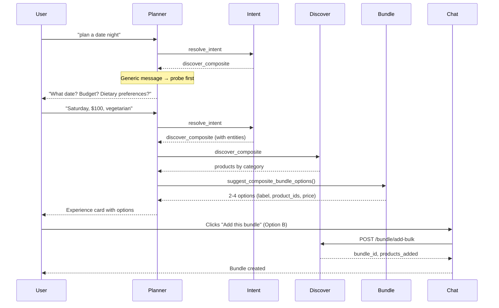

# Unified Plan: Composite Bundle (Probing → Options → Bulk Add)

Consolidates: llm-suggest-composite-bundle, date-night-multiple-bundle-options, configurable-composite-and-probing.

---

## Overview

End-to-end flow for composite experiences (e.g. date night, birthday party):

1. **Probing** – When user message is generic, system asks for date, budget, preferences before fetching products.
2. **Discover** – System fetches products per category (flowers, dinner, movies).
3. **Bundle options** – LLM suggests 2–4 curated options (one product per category per option).
4. **User picks** – User clicks "Add this bundle" on one option.
5. **Bulk add** – All products in that option are added to the bundle in one API call.

All of this is **configurable** via Platform Config (prompts, enable/disable).

---

## Full Flow (Mermaid)



---

## Part 1: Probing (When Does the System Ask Questions?)

### When Probing Happens

| User Message | Planner Action |
|--------------|----------------|
| **Generic** ("date night", "plan a date night") | Planner calls **complete** with probing questions. Does NOT call discover_composite. |
| **With details** ("Saturday $100 vegetarian") | Planner calls resolve_intent → discover_composite. Fetches products. |
| **"Just show me options"** | Planner may skip probing and fetch immediately. |

### Example Questions

- **discover_composite**: "What date? Any dietary preferences? Budget?"
- **discover** (single): "Any preferences? Occasion? Budget? Would you like to add flowers?"

The planner **generates** the wording from its prompt. Not a fixed template.

### Configuration

| Setting | Where | Purpose |
|---------|-------|---------|
| Planner prompt | Model Interactions → **planner** | When to probe, example questions |

---

## Part 2: Bundle Options (Multiple, User Picks)

### Data Structures

**Model output** (`suggest_composite_bundle_options`):

```json
{
  "options": [
    {
      "label": "Romantic Classic",
      "description": "Red roses, Italian dinner, romantic comedy.",
      "product_ids": ["uuid-1", "uuid-4", "uuid-7"],
      "total_price": 144.00
    },
    {
      "label": "Fresh & Fun",
      "description": "Tulips, sushi, live jazz.",
      "product_ids": ["uuid-2", "uuid-5", "uuid-8"],
      "total_price": 135.00
    }
  ]
}
```

**Experience card payload** (per option):

```json
{
  "action": "add_bundle_bulk",
  "product_ids": ["uuid-2", "uuid-5", "uuid-8"],
  "option_label": "Fresh & Fun"
}
```

### Product Info to Model

- **Format**: Top N products per category (id, name, price, category) – N is configurable
- **Validation**: Only product IDs from provided list; one product per category per option

---

## Part 2b: How We Pick Top N Products Per Category

### Current Flow

1. **Orchestrator** (`loop.py`): `per_limit = max(5, limit // len(search_queries))` – divides total limit across categories
2. **Discovery** (per category): `search(query, limit=per_limit)` → semantic/text search
3. **Ranking** (`scout_engine._apply_ranking`): Sorts by `sort_products_by_rank` which:
   - Uses `ranking_policy` (price, rating, commission, trust)
   - **Sponsorship boost**: Products in `product_sponsorships` (active) get +0.5 score
   - Respects `sponsorship_pricing.max_sponsored_per_query` and `sponsorship_enabled`
4. **Result**: Top N products per category, already ranked (sponsorship-aware)

### Configurable in Admin

| Setting | Type | Default | Purpose |
|---------|------|---------|---------|
| `products_per_category` | int (1–10) | 5 | How many products to fetch per category for composite discovery |
| `sponsorship_enabled` | boolean | true | Apply sponsorship boost when ranking |
| `product_mix` | array of slices | see below | Mix of slices by sort criteria and percentage |

---

## Part 2c: Product Mix Selection (Multiple Options)

**Problem**: Always sending the same top N products means the rest of the catalog never gets exposure (search or bundles).

**Solution**: Configurable **product mix** – each slice has a sort criteria, limit, and percentage. Final list is composed from multiple slices.

### Slice Types (Sort Criteria)

| Slice type | Sort | Data source |
|------------|------|-------------|
| `price_desc` | Price highest → lowest | `products.price` |
| `price_asc` | Price lowest → highest | `products.price` |
| `rating` | Top rated | `partners.trust_score` (or product rating if added) |
| `popularity` | Most sold | Aggregate from `order_items` or `bundle_legs` (requires sold_count) |
| `sponsored` | Sponsored first | `product_sponsorships` (active) |
| `recent` | Newest first | `products.created_at` |

### Config Schema

```json
{
  "product_mix": [
    { "sort": "price_desc", "limit": 10, "pct": 50 },
    { "sort": "price_asc", "limit": 10, "pct": 20 },
    { "sort": "rating", "limit": 10, "pct": 10 },
    { "sort": "popularity", "limit": 10, "pct": 10 },
    { "sort": "sponsored", "limit": 10, "pct": 10 }
  ]
}
```

- **pct** must sum to 100 (or we normalize).
- **limit** = max products to consider from that slice (e.g. "top 10 by price desc").
- **Deduplication**: A product can appear in multiple slices (e.g. sponsored + top-rated). First occurrence wins; fill remaining slots from next slice.

### Example: 5 products per category

| Slice | pct | Count | Source |
|-------|-----|-------|--------|
| price_desc | 50% | 2–3 | Top 10 by price desc |
| price_asc | 20% | 1 | Top 10 by price asc |
| rating | 10% | 0–1 | Top 10 by rating |
| popularity | 10% | 0–1 | Top 10 most sold |
| sponsored | 10% | 0–1 | Top 10 sponsored |

### Implementation

| Component | Change |
|-----------|--------|
| **Discovery** | New `product_mix` mode: fetch more products (e.g. 50), apply each sort, take from slices by pct, dedupe, return N |
| **DB** | `products.sold_count` or aggregate from `order_items`/`bundle_legs` for popularity (migration) |
| **platform_config** | `composite_discovery_config.product_mix` array |
| **Config UI** | "Product Mix" section: add/remove slices, set sort/limit/pct per slice, validation (pct sums to 100) |

### Popularity (Most Sold)

- **Option A**: Add `sold_count` to products, updated by order webhook or nightly job.
- **Option B**: Aggregate on-the-fly: `SELECT product_id, COUNT(*) FROM order_items GROUP BY product_id` (slower).
- **Option C**: Materialized view `product_sales_counts` refreshed periodically.

**Recommendation**: Option A for simplicity; Option C if real-time matters.

### Scope: Composite + Single Discovery

Product mix applies to **both** composite discovery (bundles) and single-category search. Same config used for `/discover` when `product_mix` is present; otherwise fall back to current ranking.

### Implementation (Product Mix)

| Location | Change |
|----------|--------|
| **Discovery** | When `product_mix` present: fetch more products, apply each sort slice, take by pct, dedupe, return N |
| **DB** | `products.sold_count` or materialized view for popularity |
| **Config UI** | Product Mix editor: add/remove slices, sort/limit/pct, validate pct sums to 100 |

### Migration

```sql
ALTER TABLE platform_config ADD COLUMN IF NOT EXISTS composite_discovery_config JSONB DEFAULT '{
  "products_per_category": 5,
  "sponsorship_enabled": true,
  "product_mix": [
    {"sort": "price_desc", "limit": 10, "pct": 50},
    {"sort": "price_asc", "limit": 10, "pct": 20},
    {"sort": "rating", "limit": 10, "pct": 10},
    {"sort": "popularity", "limit": 10, "pct": 10},
    {"sort": "sponsored", "limit": 10, "pct": 10}
  ]
}'::jsonb;
COMMENT ON COLUMN platform_config.composite_discovery_config IS 'Composite discovery: products per category, product mix (sort slices with pct), sponsorship';
```

---

## Part 3: Bulk Add API

### Request

```json
POST /api/v1/bundle/add-bulk
{
  "product_ids": ["uuid-1", "uuid-2", "uuid-3"],
  "user_id": "optional",
  "bundle_id": "optional"
}
```

### Response

```json
{
  "bundle_id": "uuid",
  "products_added": ["Product A", "Product B", "Product C"],
  "total_price": 125.00,
  "currency": "USD"
}
```

---

## Part 4: Configuration

### Model Interaction Prompts

| Interaction | When Used | Editable |
|-------------|-----------|----------|
| **planner** | Decides next action; when to probe vs fetch | Yes |
| **suggest_composite_bundle** | Picks products for 2–4 bundle options | Yes (new) |
| **engagement_discover_composite** | User-facing message after products | Yes |

### Platform Config

| Setting | Type | Purpose |
|---------|------|---------|
| `enable_composite_bundle_suggestion` | boolean | Turn LLM bundle options on/off (default: true) |
| `composite_discovery_config` | JSONB | `products_per_category`, `sponsorship_enabled`, `product_mix` (array of slices) |
| `composite_discovery_config.product_mix` | array | `[{ sort, limit, pct }]` – e.g. 50% price_desc, 20% price_asc, 10% rating, 10% popularity, 10% sponsored |

### Migration: suggest_composite_bundle

```sql
INSERT INTO model_interaction_prompts (interaction_type, display_name, when_used, system_prompt, enabled, max_tokens, display_order)
VALUES (
  'suggest_composite_bundle',
  'Bundle Curation (Composite)',
  'When discover_composite returns products. LLM suggests 2-4 bundle options (one product per category per option).',
  'You are a bundle curator. Given categories with products for a composite experience, suggest 2-4 different options. Each option: one product per category. Return JSON: { options: [{ label, description, product_ids, total_price }] }. ONLY use product IDs from the list. Consider: theme fit, budget, diversity between options.',
  true, 500, 8
);
```

---

## Current State vs Target

| Component | Current | Target |
|-----------|---------|--------|
| `suggest_composite_bundle()` | Single option | Replace with `suggest_composite_bundle_options()` → 2–4 options |
| Loop | Calls suggest, stores `suggested_bundle_product_ids` | Store `suggested_bundle_options` (list of option dicts) |
| Experience card | One "Add curated bundle" button | One "Add this bundle" per option |
| Bulk add API | Not implemented | Discovery + Orchestrator + Chat handler |
| Configurable prompts | planner, engagement | Add suggest_composite_bundle |
| Enable/disable | N/A | platform_config flag (optional) |

---

## Implementation Order

### Phase 1: Bulk Add API (required for "Add this bundle")

| Step | File | Change |
|------|------|--------|
| 1.1 | `services/discovery-service/db.py` | Add `add_products_to_bundle_bulk()` |
| 1.2 | `services/discovery-service/api/products.py` | Add `AddBulkBody`, `POST /bundle/add-bulk` |
| 1.3 | `services/orchestrator-service/clients.py` | Add `add_to_bundle_bulk()` |
| 1.4 | `services/orchestrator-service/api/products.py` | Add proxy `POST /bundle/add-bulk` |

### Phase 2: Chat UI Handler

| Step | File | Change |
|------|------|--------|
| 2.1 | `apps/uso-unified-chat` (AdaptiveCardRenderer / action handler) | Handle `add_bundle_bulk` action |

### Phase 3: Multiple Bundle Options

| Step | File | Change |
|------|------|--------|
| 3.1 | `services/orchestrator-service/agentic/response.py` | Add `suggest_composite_bundle_options()` (or replace existing) |
| 3.2 | `services/orchestrator-service/agentic/loop.py` | Call new function, store `suggested_bundle_options` |
| 3.3 | `packages/shared/adaptive_cards/experience_card.py` | Accept `suggested_bundle_options`, render "Add this bundle" per option |

### Phase 4: Configurable

| Step | File | Change |
|------|------|--------|
| 4.1 | Migration | Add `suggest_composite_bundle` to model_interaction_prompts |
| 4.2 | `response.py` | Fetch prompt from DB when available |
| 4.3 | Migration (optional) | Add `enable_composite_bundle_suggestion` to platform_config |
| 4.4 | `loop.py` | Check flag before calling suggest |
| 4.5 | Migration | Add `composite_discovery_config` to platform_config |
| 4.6 | `loop.py` | Read `products_per_category` from config for `per_limit` |
| 4.7 | Config UI | "Composite Discovery" section: products per category, sponsorship checkbox |
| 4.8 | Discovery | Implement `product_mix` mode: fetch by slices, compose by pct, dedupe |
| 4.9 | Migration | Add `sold_count` to products (or materialized view) for popularity |
| 4.10 | Config UI | "Product Mix" editor: add/remove slices, sort/limit/pct, validate pct=100 |

---

## Experience Card Layout (Target)

```
Your Date Night Bundle
─────────────────────
Option A: Romantic Classic – Red Roses + Italian + Comedy ($144)
[Add this bundle]

Option B: Fresh & Fun – Tulips + Sushi + Live Jazz ($135)
[Add this bundle]

Option C: Budget-Friendly – Sunflowers + Picnic + Movie ($69)
[Add this bundle]
─────────────────────
[Per-category product listings below]
```

---

## Risks and Mitigations

| Risk | Mitigation |
|------|-------------|
| LLM returns invalid product IDs | Validate against valid_ids; only accept IDs from discovery result |
| LLM fails or times out | Return empty list; no bundle options; user adds individually |
| Action.Submit array serialization | Ensure product_ids array sent correctly |
| Duplicate products | Bulk add adds each product once; existing logic handles duplicates |

---

## Testing Steps

1. **Probing**: "plan a date night" → verify probing questions; answer → verify products fetched
2. **Bulk add API**: `curl -X POST $DISCOVERY/api/v1/bundle/add-bulk -d '{"product_ids":["id1","id2"]}'`
3. **End-to-end**: "plan a date night" with details → verify 2–4 options → click "Add this bundle" → verify bundle created
4. **Config**: Edit suggest_composite_bundle prompt → verify different curation style
5. **Disable**: Set `enable_composite_bundle_suggestion: false` → verify no options, products only

---

## Files to Modify (Summary)

| Phase | File | Change |
|-------|------|--------|
| 1 | discovery-service/db.py | `add_products_to_bundle_bulk()` |
| 1 | discovery-service/api/products.py | `POST /bundle/add-bulk` |
| 1 | orchestrator-service/clients.py | `add_to_bundle_bulk()` |
| 1 | orchestrator-service/api/products.py | Proxy `/bundle/add-bulk` |
| 2 | uso-unified-chat | Handle `add_bundle_bulk` action |
| 3 | agentic/response.py | `suggest_composite_bundle_options()` |
| 3 | agentic/loop.py | Call new fn, store `suggested_bundle_options` |
| 3 | adaptive_cards/experience_card.py | Multiple options UI |
| 4 | Migration | suggest_composite_bundle prompt |
| 4 | response.py | Use DB prompt when available |
| 4 | loop.py | Check enable flag (optional) |
| 4 | Migration | composite_discovery_config |
| 4 | loop.py | Use products_per_category for per_limit |
| 4 | config-editor.tsx | Composite Discovery section (products per category, sponsorship) |
| 4 | discovery-service | product_mix mode: slices by sort, compose by pct |
| 4 | products table | sold_count or materialized view for popularity |
| 4 | config-editor.tsx | Product Mix editor (slices: sort, limit, pct) |
