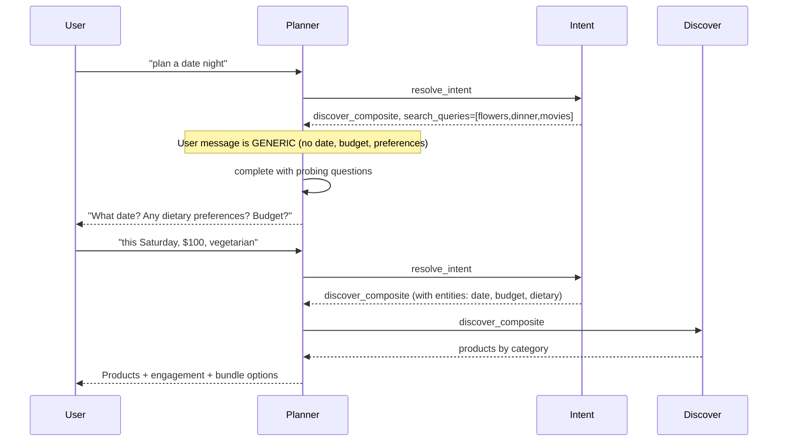

# Plan: Configurable Composite Bundle + Probing Questions

> **Superseded by**: [composite-bundle-unified-plan.md](./composite-bundle-unified-plan.md) – all composite bundle plans are consolidated there.

## Overview

1. **Make bundle suggestion configurable** – Admins can edit the prompt that guides how the model picks products for composite bundle options.
2. **Clarify when the system asks probing questions** – Document the flow and make probing behavior configurable (date, budget, preferences, etc.).

---

## When Does the System Ask Probing Questions?

### Current Flow



### When Probing Happens

| Trigger | Planner Action |
|---------|----------------|
| **Generic request** (e.g. "date night", "plan a date night") | Planner calls **complete** with probing questions. Does NOT call discover_composite yet. |
| **User provides details** (date, budget, preferences) | Planner calls **resolve_intent** then **discover_composite**. Fetches products. |
| **User says "just show me options"** | Planner may skip probing and call discover_composite immediately. |

### What Questions Are Asked?

The **planner prompt** instructs the model. Current (hardcoded) examples:

- **discover_composite**: "What date? Any dietary preferences? Budget?"
- **discover** (single): "Any preferences? Occasion? Budget? Would you like to add something like flowers with that?"

The planner **generates** the exact wording. It is not a fixed template. The prompt gives examples; the model produces similar questions.

### Where Probing Is Controlled

| Component | Configurable? | Location |
|-----------|---------------|----------|
| **Planner** (when to probe, example questions) | Yes – via model_interaction_prompts `planner` | Platform Config → Model Interactions → planner |
| **Tool definitions** (discover_composite description) | Yes – could add to model_interaction_prompts | tools.py or new interaction type |

---

## Making It Configurable

### 1. Planner Prompt (Already Configurable)

- **Where**: Platform Config → Model Interactions → **planner**
- **What**: System prompt that controls when to probe and what to ask
- **Example addition** for admins:
  ```
  For discover_composite, when generic, ask: [date], [budget], [dietary preferences], [location if relevant].
  Customize these as needed for your business.
  ```

### 2. Probing Questions Template (New – Optional)

Add a **platform_config** or **model_interaction_prompts** field for explicit probing questions:

| Option | Approach | Pros | Cons |
|--------|----------|------|------|
| **A** | Rely on planner prompt only | No schema change | Less structured |
| **B** | `platform_config.composite_probe_questions` | Structured list admins can edit | New config, needs UI |
| **C** | New interaction type `probe_composite` | Reuses model_interaction_prompts | More complex |

**Recommendation**: **Option A** for now. The planner prompt is already configurable. Admins can edit it to change probing behavior. Add Option B later if needed.

### 3. Bundle Suggestion Prompt (New)

Add **suggest_composite_bundle** to `model_interaction_prompts` so the bundle curation prompt is configurable.

**Migration**: Add row to `model_interaction_prompts`:

```sql
INSERT INTO model_interaction_prompts (interaction_type, display_name, when_used, system_prompt, enabled, max_tokens, display_order)
VALUES (
  'suggest_composite_bundle',
  'Bundle Curation (Composite)',
  'When discover_composite returns products. LLM picks 2-4 bundle options (one product per category per option). Used to suggest date night / experience plans.',
  'You are a bundle curator. Given categories with products for a composite experience, suggest 2-4 different options. Each option: one product per category. Return JSON: { options: [{ label, description, product_ids, total_price }] }. ONLY use product IDs from the list. Consider: theme fit, budget, diversity between options.',
  true,
  500,
  8
);
```

**Code**: `suggest_composite_bundle()` / `suggest_composite_bundle_options()` should fetch prompt from `get_model_interaction_prompt(client, "suggest_composite_bundle")` when available, else use code default.

### 4. Enable/Disable Bundle Suggestion (Optional)

Add `platform_config.enable_composite_bundle_suggestion` (boolean):

- **true**: Call suggest_composite_bundle_options after discover_composite (default)
- **false**: Skip; show products only, no curated options

---

## Configuration Summary

| Setting | Where | Purpose |
|---------|-------|---------|
| **Planner prompt** | Model Interactions → planner | When to probe, example questions (date, budget, preferences) |
| **Bundle curation prompt** | Model Interactions → suggest_composite_bundle (new) | How model picks products for each option |
| **Enable bundle suggestion** | platform_config (optional) | Turn LLM bundle options on/off |
| **Probing questions** | Embedded in planner prompt | No separate config; edit planner prompt to change |

---

## Probing Flow (Detailed)

### Step 1: User sends generic request

- **Examples**: "plan a date night", "date night", "help me plan a date"
- **Intent**: discover_composite, search_queries = [flowers, dinner, movies] (or similar)

### Step 2: Planner decides

- **Input**: User message, intent, last_suggestion, recent_conversation
- **Logic**: If message is generic (no date, budget, preferences, location), planner chooses **complete** with probing questions
- **Output**: Planner returns `action: "complete"`, `message: "What date did you have in mind? Any dietary preferences? What's your budget?"`

### Step 3: User sees questions

- Chat displays the planner's message
- No products fetched yet

### Step 4: User answers

- **Examples**: "this Saturday", "$100 budget", "vegetarian", "in San Francisco"
- **Intent**: resolve_intent extracts entities (date, budget, dietary, location)

### Step 5: Planner fetches products

- Planner sees user provided details (or last_suggestion contained questions)
- Planner calls **discover_composite**
- Products returned

### Step 6: Bundle options (if enabled)

- `suggest_composite_bundle_options()` runs
- Model suggests 2–4 options
- User picks one

---

## Implementation Checklist

| Task | File / Location |
|------|-----------------|
| Add `suggest_composite_bundle` to model_interaction_prompts | Migration |
| Wire suggest_composite_bundle to use DB prompt | response.py |
| Document probing in planner prompt (when_used) | model_interaction_prompts migration or Config UI |
| Add enable_composite_bundle_suggestion (optional) | platform_config migration, loop.py |
| Config UI: show suggest_composite_bundle in Model Interactions | config-editor.tsx (already lists all interaction types from DB) |

---

## Admin UX

**Platform Config → Model Interactions** would show:

| Interaction | When Used | Editable |
|--------------|-----------|----------|
| planner | Decides next action; when to probe vs fetch | Yes |
| suggest_composite_bundle | Picks products for bundle options | Yes (new) |
| engagement_discover_composite | User-facing message after products | Yes |

**Example planner prompt edit** (for custom probing):

```
For discover_composite: When the user message is generic (no date, budget, preferences),
call complete with 2-3 questions. Ask: (1) When? (2) Budget? (3) Dietary or preferences?
Only call discover_composite when user has answered or explicitly asks for options.
```
