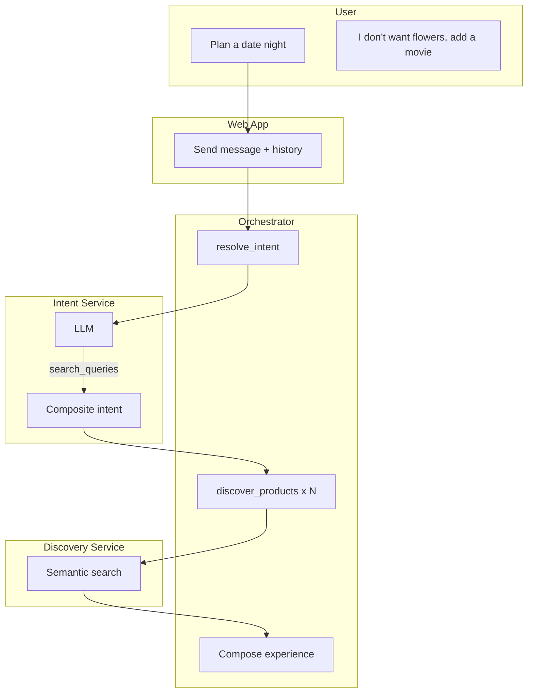
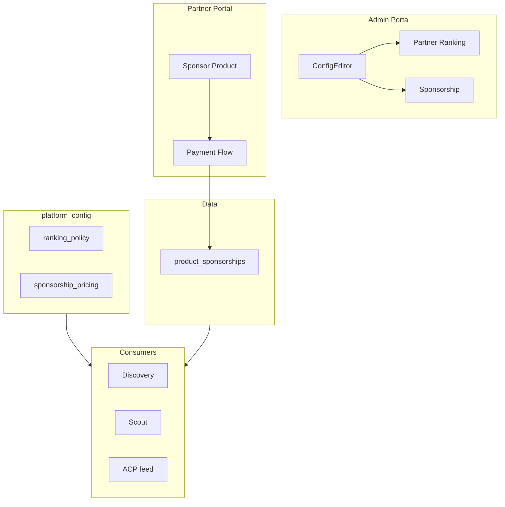
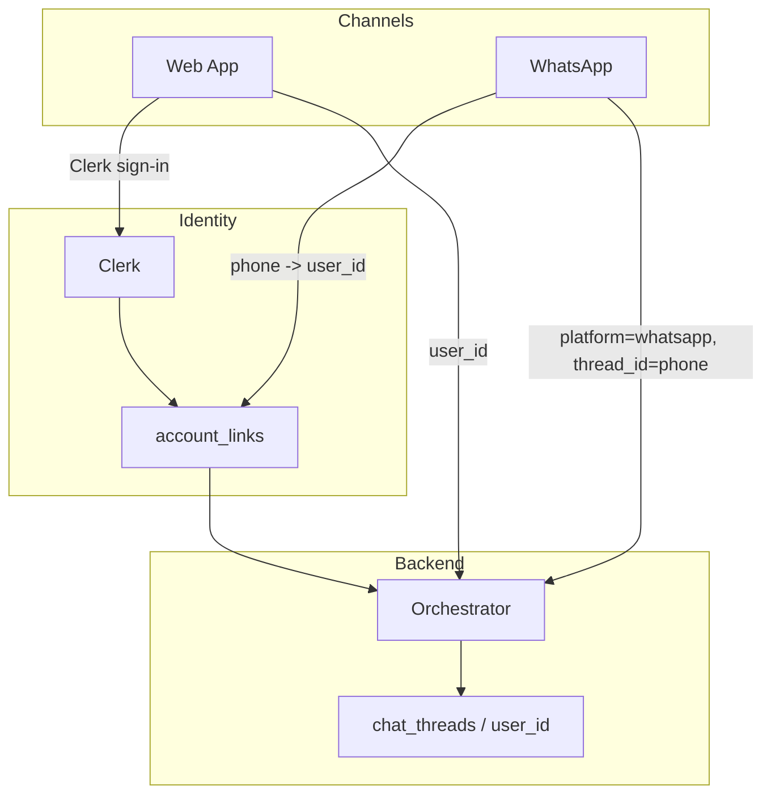

# USO Consolidated Plan

Merges: **Unified Chat E2E**, **Experience Bundling**, **Partner Ranking**, **LLM Choice**, **Admin LLM Config**, **Return Visit & Standing Intent UX**.

**Implementation:** Two parallel tracks. **Track A** (Phase 1 + 4): Core UX + Persistence & Identity. **Track B** (Phase 2 + 3): Discovery & LLM + Partner Platform.

---

## Part 1: Unified Chat E2E (Completed)

**Status: Done.** Reference only.

- Adaptive Card rendering, bundle state, action handlers, checkout, payment
- API proxy routes for bundle, checkout, payment
- Tailwind, Framer Motion, class-leading chat layout
- `partner_chat_config` table (theme, branding, embed settings)
- Chat API accepts `partner_id`; filter products, inject KB/FAQ
- Embeddable script/widget for partner websites
- Partner portal: Chat Widget Settings at `/settings/chat-widget`
- Admin portal: Enable/disable chat and E2E features per partner

**Key files:** `partner_chat_config`, `apps/portal/app/(partner)/settings/chat-widget/`, `apps/uso-unified-chat/app/embed/`, orchestrator chat with `partner_id`.

### 1b. Stripe Payment UI (Real Card Payments)

**Status: Done.**

**Goal:** Web app is fully E2E capable. User can enter card and pay without leaving the chat.

**Implemented:** PaymentModal with Stripe Elements; `POST /api/payment/create` proxy; `complete_checkout` opens modal when `NEXT_PUBLIC_STRIPE_PUBLISHABLE_KEY` set; return flow via `?payment_success=1&order_id=X`; fallback to demo `payment/confirm` when Stripe not configured.

**Implementation:**

1. **Dependencies** — Add `@stripe/stripe-js`, `@stripe/react-stripe-js` to [apps/uso-unified-chat/package.json](apps/uso-unified-chat/package.json).

2. **Env** — `NEXT_PUBLIC_STRIPE_PUBLISHABLE_KEY` in unified chat (Vercel env).

3. **API** — Add `POST /api/payment/create` in unified chat. Proxy to orchestrator `POST /api/v1/payment/create` (which calls payment service). Returns `{ client_secret, amount, currency }`.

4. **PaymentModal component** — New `components/PaymentModal.tsx`:
   - Props: `orderId`, `amount`, `currency`, `onClose`, `onSuccess`
   - Load Stripe with `loadStripe(publishableKey)`
   - Fetch `client_secret` from `/api/payment/create` with `order_id`
   - Render `Elements` + `PaymentElement` + Pay button
   - On submit: `stripe.confirmPayment({ elements, confirmParams: { return_url } })`
   - `return_url`: Same chat page with `?payment_success=1&order_id=X` so user returns to chat after 3DS or success
   - On success (or when user returns with payment_success): `onSuccess()` adds "Payment confirmed!" message to chat

5. **ChatPage** — When user clicks "Complete checkout" / "Pay" (`complete_checkout` action with `order_id`):
   - If `NEXT_PUBLIC_STRIPE_PUBLISHABLE_KEY` set: Open PaymentModal. On success/return, add success message.
   - If Stripe not configured: Fall back to `payment/confirm` (demo mode) for testing.

6. **Return flow** — On chat page load, check `?payment_success=1&order_id=X`. If present, add success message to chat, clear URL params (replaceState).

7. **Embed** — PaymentModal works in embed; ensure `return_url` uses embed URL when in iframe (e.g. `parentOrigin` or same origin).

**Key files:**
- [apps/uso-unified-chat/components/PaymentModal.tsx](apps/uso-unified-chat/components/PaymentModal.tsx) (new)
- [apps/uso-unified-chat/app/api/payment/create/route.ts](apps/uso-unified-chat/app/api/payment/create/route.ts) (new) — proxy to orchestrator
- [ChatPage.tsx](apps/uso-unified-chat/components/ChatPage.tsx) — open modal on complete_checkout; handle payment_success on mount

**Reference:** [apps/portal/app/(partner)/pay/page.tsx](apps/portal/app/(partner)/pay/page.tsx) — Stripe Elements pattern.

### 1c. Welcoming Landing Page

**Status: Done.**

**Goal:** Single-page view that showcases what the platform can do.

**Implemented:** LandingHero, ExamplePrompts, single-page composition in page.tsx; prompt chips send to chat and scroll to chat section.

**Layout (single page, top to bottom):**

1. **Hero section**
   - Headline: e.g. "Discover, bundle, and order — in one conversation"
   - Subheadline: Brief value prop (e.g. "Find products, add to cart, and pay — all through chat")
   - Optional: subtle gradient or brand visual

2. **Capability showcase** — 3–4 cards or icons
   - **Discover** — "Search products in natural language. Say 'find roses' or 'best chocolates for mom'."
   - **Bundle** — "Add multiple items to one order. Plan a date night, anniversary gift, or event."
   - **Checkout** — "Complete your order and pay securely — no leaving the chat."
   - **Standing intents** — "Set reminders: 'Notify me when X goes on sale.'" (optional)

3. **Example prompts** — Clickable chips or buttons
   - "Find flowers for delivery"
   - "Plan a date night"
   - "Best birthday gifts under $50"
   - "Show me chocolates"
   - Clicking sends that prompt to the chat and scrolls/focuses the chat input

4. **Chat section** — Full chat UI below
   - Same ChatPage component
   - Optional: Collapsible or "Start chatting" CTA that expands to full chat
   - Or: Chat always visible; hero + capabilities above it (user scrolls to chat)

**Responsive:** On mobile, hero + 2 capability cards stacked; example prompts as horizontal scroll; chat below.

**Embed mode:** When `partner_id` in URL (embed), optionally show minimal or partner-branded hero (or skip hero, chat-first). Configurable via `partner_chat_config` (e.g. `show_landing: boolean`).

**Implementation:**
- New `components/LandingHero.tsx` — Hero + capability cards
- New `components/ExamplePrompts.tsx` — Clickable prompt chips; `onSelect(prompt)` callback
- Refactor `app/page.tsx` — Render `LandingHero` + `ExamplePrompts` + `ChatPage` in a single column
- ChatPage: Accept optional `initialPrompt` prop; when set, prefill input or send on mount
- Scroll: When user clicks example prompt, scroll to chat and either send message or focus input with prompt

**Key files:**
- [apps/uso-unified-chat/components/LandingHero.tsx](apps/uso-unified-chat/components/LandingHero.tsx) (new)
- [apps/uso-unified-chat/components/ExamplePrompts.tsx](apps/uso-unified-chat/components/ExamplePrompts.tsx) (new)
- [apps/uso-unified-chat/app/page.tsx](apps/uso-unified-chat/app/page.tsx) — Compose landing + chat

---

## Part 2: LLM Strategy and Admin Config

**Sources:** llm_choice_openai_vs_gemini, admin_llm_config

### 2.1 LLM Choice (OpenAI vs Gemini)

| Priority | Recommendation |
|----------|----------------|
| **Cost-first** | Gemini 1.5 Flash primary, Pro for complex flows |
| **Quality-first** | GPT-4o primary, Gemini Flash fallback |
| **Balanced** | Tiered routing: Flash for simple, GPT-4o/Pro for complex |

**Cost (per 1M tokens):** GPT-4o ~$2.50/$10; Gemini 1.5 Pro ~$1.25/$5; Gemini 1.5 Flash ~$0.075/$0.30.

**Impact on Experience Bundling:** Composite intents ("plan a date night") need stronger reasoning. Prefer GPT-4o or Gemini 1.5 Pro for composite flows. Configurable model (below) enables A/B testing.

### 2.2 Admin Portal: Configurable LLM Settings

| Setting | Location | Rationale |
|---------|----------|------------|
| Provider (openai / gemini) | Admin portal | Runtime A/B testing |
| Model (gpt-4o, gemini-1.5-flash, etc.) | Admin portal | Test models without deploy |
| Temperature | Admin portal (as "Creativity" 0–1) | Tune precision vs variety |
| Max tokens | Env only | Safety guardrail |
| API keys | Env only | Security |

### 2.3 Schema

```sql
ALTER TABLE platform_config ADD COLUMN IF NOT EXISTS llm_provider TEXT DEFAULT 'openai';
ALTER TABLE platform_config ADD COLUMN IF NOT EXISTS llm_model TEXT DEFAULT 'gpt-4o';
ALTER TABLE platform_config ADD COLUMN IF NOT EXISTS llm_temperature DECIMAL(3,2) DEFAULT 0.10;
```

### 2.4 Admin Portal UI

**ConfigEditor:** Collapsible "LLM Settings" section:
- Provider dropdown: OpenAI | Gemini
- Model dropdown: gpt-4o, gpt-4o-mini, gemini-1.5-flash, gemini-1.5-pro
- Creativity slider (0–1) → maps to temperature

### 2.5 Backend

- **Orchestrator planner:** Read `platform_config` at request time (cache 60s TTL). Use `llm_provider`, `llm_model`, `llm_temperature` when present; fall back to env.
- **Intent service:** Optional: add Gemini support, read config. Today uses Azure OpenAI only.

### 2.6 Web App: Remove Provider Dropdown

Remove ChatGPT/Gemini provider dropdown from [ChatPage.tsx](apps/uso-unified-chat/components/ChatPage.tsx). Web app is primary chat surface; backend LLM is admin-configured. Pass `platform: "web"` or omit.

### 2.7 Key Files

| File | Change |
|------|--------|
| New migration | Add llm_provider, llm_model, llm_temperature |
| [config-editor.tsx](apps/portal/app/(platform)/platform/config/config-editor.tsx) | LLM Settings section |
| [platform/config/route.ts](apps/portal/app/api/platform/config/route.ts) | PATCH llm_* fields |
| [planner.py](services/orchestrator-service/agentic/planner.py) | Read config, use provider/model/temp; cache |
| [admin.py](services/orchestrator-service/api/admin.py) | Extend get_platform_config with llm_* |
| [ChatPage.tsx](apps/uso-unified-chat/components/ChatPage.tsx) | Remove provider dropdown |

---

## Part 3: Experience Bundling

**Goal:** Users ask "plan a date night" and receive a composed bundle from the catalog. Conversational refinement supported.

**Note:** Composite intents benefit from stronger models (GPT-4o or Gemini 1.5 Pro). Use Admin LLM Config (Part 2) to select model for testing.

### 3.1 Action-Word Stripping (Replace Keywords)

**Files:** [services/intent-service/llm.py](services/intent-service/llm.py), [packages/shared/discovery.py](packages/shared/discovery.py)

- Remove `_PRODUCT_KEYWORDS`. Add `_derive_search_query(text)` that strips action/filler words.
- When LLM returns bad single query, use derived query from raw message.
- Fixes "wanna book limo service" → "limo" without keyword list.

### 3.2 Composite Intent (Intent Service)

**File:** [services/intent-service/llm.py](services/intent-service/llm.py)

- New intent type: `discover_composite` for experience phrases.
- Response shape: `{ "intent_type": "discover_composite", "search_queries": ["flowers","dinner","limo"], "experience_name": "date night", ... }`
- LLM prompt: Decompose experiences into product categories. Optional: pass catalog categories as hints.

### 3.3 Multi-Query Orchestration

**Files:** [services/orchestrator-service/agentic/loop.py](services/orchestrator-service/agentic/loop.py), [tools.py](services/orchestrator-service/agentic/tools.py)

- When intent is `discover_composite`, call `discover_products` per query, merge results.
- Compose: `{ "experience_name": "...", "categories": [ { "query": "flowers", "products": [...] }, ... ] }`.

### 3.4 Experience Bundle Adaptive Card

**File:** New `packages/shared/adaptive_cards/experience_card.py`

- Group products by category. Header: "Your date night bundle". Sections: Flowers, Dinner, Transport.
- Same actions per product: Add to Bundle, View Details.

### 3.5 Conversation History for Refinement

**Files:** [services/orchestrator-service/api/chat.py](services/orchestrator-service/api/chat.py), [apps/uso-unified-chat/app/api/chat/route.ts](apps/uso-unified-chat/app/api/chat/route.ts)

- ChatRequest: Add `messages?: { role, content }[]`.
- Planner state: Include `last_suggestion` so "I don't want flowers, add a movie" can be interpreted.

**Order:** 1) Action-word stripping, 2) Composite intent, 3) Multi-query orchestration, 4) Experience card, 5) Conversation history.

### 3.6 Architecture



---

## Part 4: Partner Ranking and Sponsorship

**Goal:** Configurable partner ranking when multiple partners sell similar products. Partners can pay for product sponsorship.

### 4.1 Current State

- Each product has one `partner_id`; "same" product from different partners = separate records.
- Text search: `created_at DESC`; semantic search: embedding similarity only. No partner-level ranking.
- Existing signals: `partners.trust_score`, `partner_ratings.avg_rating`, `commission_breaks`.

### 4.2 Schema

**Migration:** Add to `platform_config`:
- `ranking_enabled` BOOLEAN DEFAULT true
- `ranking_policy` JSONB: `{ "strategy": "weighted", "weights": { "price": 0.3, "rating": 0.3, "commission": 0.2, "trust": 0.2 }, "price_direction": "asc" }`
- `ranking_edge_cases` JSONB: `{ "missing_rating": 0.5, "missing_commission": 0, "missing_trust": 0.5, "tie_breaker": "created_at" }`
- `sponsorship_pricing` JSONB: `{ "product_price_per_day_cents": 1000, "max_sponsored_per_query": 3, "sponsorship_enabled": true }`

**New table:** `product_sponsorships` (id, product_id, partner_id, start_at, end_at, amount_cents, currency, status, stripe_payment_intent_id).

### 4.3 Ranking Module

**File:** `packages/shared/ranking.py`

- `compute_product_rank_score(product, partner, partner_rating, commission_pct, config) -> float`
- `sort_products_by_rank(products, ..., active_sponsorships, config)` — sponsored products get boost (up to max_sponsored_per_query).

### 4.4 Discovery Integration

Apply ranking in `search_products`, `semantic_search`, `scout_engine`, ACP feed.

### 4.5 Admin Portal

**ConfigEditor:** Partner Ranking section (strategy, weights, edge cases), Sponsorship section (enable, price per day, max per query).

### 4.6 Partner Sponsorship Flow

- Partner portal: "Sponsor this product" button → choose duration → pay via Stripe.
- API: `POST /api/partners/sponsorship/create`, `GET /api/partners/sponsorship`.
- Webhook: `payment_intent.succeeded` with `type=sponsorship` → create `product_sponsorships` row.

### 4.7 Architecture



### 4.8 Key Files

| File | Change |
|------|--------|
| New migration | Add ranking_*, sponsorship_pricing; create product_sponsorships |
| [config-editor.tsx](apps/portal/app/(platform)/platform/config/config-editor.tsx) | Partner Ranking and Sponsorship sections |
| [api/platform/config/route.ts](apps/portal/app/api/platform/config/route.ts) | GET/PATCH ranking and sponsorship |
| `packages/shared/ranking.py` (new) | compute_product_rank_score, sort_products_by_rank |
| [discovery-service/db.py](services/discovery-service/db.py) | Apply ranking in search_products |
| [discovery-service/semantic_search.py](services/discovery-service/semantic_search.py) | Apply ranking |
| New: `apps/portal/app/api/partners/sponsorship/route.ts` | POST create, GET list |
| New: Partner products sponsor UI | Sponsor button, payment flow |
| [payment-service webhook](services/payment-service/webhooks/stripe_webhook.py) | Handle sponsorship → product_sponsorships |

---

## Part 5: Return Visit and Standing Intent UX

**Goal:** User can return to the web app later to continue a conversation, and long-standing instructions (e.g. "notify me when roses are on sale") are surfaced when they come back.

### 5.1 Current Gaps

- **Session**: `sessionId` is a new UUID on each page load. No persistence.
- **Messages**: Stored only in React state. Refresh = lose everything.
- **Bundle**: Tied to `sessionId`; lost on refresh.
- **Standing intents**: Backend supports `create_standing_intent` with `platform` + `thread_id` for webhook push. Web app has no persistent `thread_id`; no way to receive approval when user returns.

### 5.2 User Flows

**Flow A: Return to continue conversation (anonymous)**

1. User chats, gets product suggestions, adds to bundle.
2. User closes tab or navigates away.
3. User returns later (same device, same browser).
4. **Expected**: See previous conversation and bundle. Can refine ("add chocolates") or checkout.

**Flow B: Return to continue conversation (signed-in)**

1. Same as A, but user is signed in (Clerk).
2. User returns from a different device.
3. **Expected**: See conversation list; select thread; continue. Bundle and history available.

**Flow C: Standing intent — "Notify me when X"**

1. User says "notify me when roses go on sale".
2. System creates standing intent; approval required.
3. User leaves before approving.
4. User returns later.
5. **Expected**: See pending approval card in chat. Approve or reject. Or receive email with link to approve.

### 5.3 Schema: Chat Threads

**New table** `chat_threads` (for web app discovery chat, distinct from `conversations` which is partner support):

```sql
CREATE TABLE chat_threads (
  id UUID PRIMARY KEY DEFAULT gen_random_uuid(),
  user_id UUID REFERENCES users(id),           -- NULL if anonymous
  anonymous_id TEXT,                            -- localStorage key when not signed in
  partner_id UUID REFERENCES partners(id),     -- When embedded
  title TEXT,                                   -- Auto-generated from first message
  bundle_id UUID REFERENCES bundles(id),
  created_at TIMESTAMPTZ DEFAULT NOW(),
  updated_at TIMESTAMPTZ DEFAULT NOW()
);

CREATE TABLE chat_messages (
  id UUID PRIMARY KEY DEFAULT gen_random_uuid(),
  thread_id UUID NOT NULL REFERENCES chat_threads(id) ON DELETE CASCADE,
  role VARCHAR(20) NOT NULL,                    -- 'user' | 'assistant'
  content TEXT,
  adaptive_card JSONB,
  channel VARCHAR(20) DEFAULT 'web',           -- 'web' | 'whatsapp' (for cross-channel)
  created_at TIMESTAMPTZ DEFAULT NOW()
);

CREATE INDEX idx_chat_threads_user_id ON chat_threads(user_id);
CREATE INDEX idx_chat_threads_anonymous_id ON chat_threads(anonymous_id);
CREATE INDEX idx_chat_messages_thread_id ON chat_messages(thread_id);
```

- **anonymous_id**: Client generates UUID, stores in localStorage. Sent with every request. Enables "continue on same device" without auth.
- **user_id**: When signed in (Clerk), link thread to user. Enables cross-device and standing intent association.

### 5.4 API

- `POST /api/chat` — Extend: accept `thread_id`. If present, load thread, append message, persist. If absent, create new thread, return `thread_id`. Forward `thread_id` to orchestrator for standing intent creation.
- `GET /api/threads` — List threads for `user_id` (auth required) or `anonymous_id` (from header/cookie). Returns `[{ id, title, updated_at }]`.
- `GET /api/threads/[id]` — Load thread + messages. Validate `user_id` or `anonymous_id` matches.
- `GET /api/threads/[id]/pending-approvals` — Standing intents for this thread with status `pending`. Show approval card when user returns.

### 5.5 Web App UX

**Anonymous (no auth)**

1. On first visit: create thread, store `thread_id` in localStorage.
2. On subsequent requests: send `thread_id` in payload. Backend persists messages.
3. On return: read `thread_id` from localStorage. Call `GET /api/threads/[id]` to load messages. Render.
4. Welcome: "Welcome back. Here's where we left off."

**Signed-in (optional Clerk)**

1. On sign-in: list threads via `GET /api/threads`. Show sidebar or "Recent" dropdown.
2. New chat: create thread, no localStorage needed.
3. Switch thread: load by id. Cross-device works.
4. Bundle: persisted in `bundles` table, linked to `chat_threads.bundle_id`.

**Standing intent**

1. When user says "notify me when X", planner calls `create_standing_intent` with `platform: "web"`, `thread_id: <current>`.
2. Standing intent stored with `thread_id` in `chat_thread_mappings` or similar (for webhook routing).
3. **When user returns**: 
   - **Option A (polling)**: On thread load, call `GET /api/threads/[id]/pending-approvals`. If any, inject approval card at top of chat.
   - **Option B (email)**: Send email "You have a pending approval" with link. Link opens app with `?approval=standing_intent_id`. App fetches approval, shows card.
4. User approves/rejects. Webhook or API updates standing intent; orchestrator continues.

### 5.6 Thread Mapping for Standing Intent

**Existing**: `standing_intents` has `platform`, `thread_id`. Webhook service pushes to ChatGPT/Gemini by `thread_id`.

**For web**: No push channel. Store `thread_id` in standing_intents. When user loads thread, API checks for pending approvals. Return them in thread payload. Client renders approval card.

### 5.7 Implementation Order (Part 5)

1. **Schema** — `chat_threads`, `chat_messages` tables.
2. **API** — Create thread on first message; persist messages; GET thread by id.
3. **Web app** — localStorage `thread_id`; send with requests; load history on mount.
4. **Standing intent** — Pass `thread_id` when creating; store `platform: "web"`. On thread load, return pending approvals.
5. **Optional auth** — Add Clerk to unified chat; `GET /api/threads` for signed-in users; list threads in sidebar.

### 5.8 Architecture

```mermaid
flowchart TB
    subgraph User [User]
        Return[Returns to web app]
        New[New visit]
    end
    subgraph WebApp [Web App]
        LS[localStorage thread_id]
        Load[Load thread]
        List[List threads if signed in]
    end
    subgraph API [API]
        CreateThread[Create thread]
        PersistMsg[Persist message]
        GetThread[GET thread + messages]
        GetApprovals[GET pending approvals]
    end
    subgraph DB [(DB)]
        Threads[chat_threads]
        Messages[chat_messages]
        Standing[standing_intents]
    end
    Return --> LS
    LS -->|thread_id| Load
    Load --> GetThread
    GetThread --> Threads
    GetThread --> Messages
    GetThread --> GetApprovals
    GetApprovals --> Standing
    New --> CreateThread
    CreateThread --> Threads
```

### 5.9 Key Files

| File | Change |
|------|--------|
| New migration | Add chat_threads, chat_messages |
| [apps/uso-unified-chat/app/api/chat/route.ts](apps/uso-unified-chat/app/api/chat/route.ts) | Accept thread_id; create/load thread; persist messages |
| New: `apps/uso-unified-chat/app/api/threads/route.ts` | GET list threads |
| New: `apps/uso-unified-chat/app/api/threads/[id]/route.ts` | GET thread + messages + pending approvals |
| [ChatPage.tsx](apps/uso-unified-chat/components/ChatPage.tsx) | localStorage thread_id; load on mount; send thread_id |
| Orchestrator chat | Accept thread_id; pass to create_standing_intent |

---

## Part 5b: Sign-In and Cross-Channel (Web + WhatsApp)

### 5b.1 How Will User Sign In?

**Web app:** Add **Clerk** (same as partner portal). Sign-in options:

- **Sign in with Google** — One-tap; links to `account_links` (platform=google, platform_user_id=sub)
- **Sign in with Email** — Email + password or magic link
- **Optional:** Sign in with Phone (SMS OTP) — Enables linking WhatsApp later

**Flow:**
1. User visits web app. Can chat anonymously (localStorage thread_id).
2. Header: "Sign in" button. Click → Clerk modal (Google, Email).
3. After sign-in: `user_id` resolved from Clerk → `users` table. Threads linked to `user_id`.
4. "Link Account" (optional): If user came from ChatGPT, they can link OpenAI identity. Same `POST /api/v1/link-account` with `provider=openai`, `platform_user_id`, `clerk_user_id`.

**Files:** Add `@clerk/nextjs` to unified chat app. Wrap with `ClerkProvider`. Use `useUser()`, `SignInButton`, `SignOutButton`. Pass `user_id` (from `users.id` via Clerk webhook or API) to chat payload.

### 5b.2 Will It Be Similar If User Starts from WhatsApp?

**Same AI experience:** Yes. Both channels call the same orchestrator (`POST /api/v1/chat`). Same intent resolution, discovery, adaptive cards. WhatsApp receives text + product list (or link to web for full cards).

**Same conversation continuity:** Depends on identity linking.

| Scenario | Web | WhatsApp | Continuity |
|----------|-----|----------|------------|
| **Anonymous** | localStorage thread | Phone = thread_id | No. Each channel independent. |
| **Signed in + WhatsApp linked** | user_id from Clerk | user_id from account_links (platform=whatsapp, platform_user_id=phone) | Yes. Same conversation. |

**To achieve continuity:**
1. **account_links** — Add `platform='whatsapp'`, `platform_user_id=<phone>`. User links phone to account.
2. **Link flow:** User signs in on web → Settings → "Connect WhatsApp" → Enter phone → Receive OTP on WhatsApp → Enter OTP → Link created.
3. **Unified conversation:** `chat_threads` (or a `conversations` table) keyed by `user_id`, not `thread_id`. Messages from web and WhatsApp both append to the same conversation. When user loads web, fetch by `user_id`. When WhatsApp message arrives, resolve `user_id` from `account_links`, append to same conversation.
4. **Thread mapping:** For WhatsApp, `chat_thread_mappings` has `platform='whatsapp'`, `thread_id=phone`. Enables standing intent webhook to push back to WhatsApp.

**Rendering differences:**
- **Web:** Full adaptive cards, add to bundle, checkout.
- **WhatsApp:** Text summary + product names/prices. "View full experience: [link]" or Twilio/WhatsApp template for product list. Add-to-bundle may be via reply ("Reply 1 to add") or link to web.

### 5b.3 Architecture: Cross-Channel



### 5b.4 Implementation Order (Sign-In + WhatsApp)

1. **Clerk in unified chat** — Add ClerkProvider, SignInButton. Resolve user_id, pass to chat.
2. **Threads by user_id** — When signed in, threads keyed by user_id. No localStorage for thread_id when signed in.
3. **WhatsApp link** — Extend link-account API: `provider=whatsapp`, `platform_user_id=phone`, OTP verification. User proves phone ownership.
4. **Omnichannel broker** — Route WhatsApp discovery messages to orchestrator. Same chat endpoint. platform=whatsapp, thread_id=phone.
5. **Unified conversation** — When user_id present, fetch/create conversation by user_id. Messages from web and WhatsApp append to same conversation.

---

## Implementation Phases

Two parallel tracks. Implement **Track A** and **Track B** independently (or in parallel).

### Track A: Core UX + Persistence & Identity

**Phase 1: Core UX**
1. ~~**Landing page**~~ — Done. Hero, capability showcase, example prompts. Single-page welcoming view.
2. ~~**Stripe UI in unified chat**~~ — Done. Stripe Elements, PaymentModal, payment/create proxy. Web app fully E2E for real payments.

**Phase 4: Persistence & Identity**
3. **Return visit UX** — chat_threads schema, persist messages, localStorage thread_id, load on return
4. **Standing intent UX** — Pass thread_id; pending approvals on thread load; approval card in chat
5. **Sign-in (Clerk)** — Add Clerk to unified chat; resolve user_id; threads by user when signed in
6. **Cross-channel (WhatsApp)** — Link WhatsApp via OTP; route WhatsApp to orchestrator; unified conversation by user_id

**Track A order:** 1 ✓ → 2 ✓ → 3 → 4 → 5 → 6 (landing and Stripe done; next: persistence, then identity and WhatsApp)

---

### Track B: Discovery & LLM + Partner Platform

**Phase 2: Discovery & LLM**
1. **LLM Admin Config** — Schema, ConfigEditor, planner reads config, remove web app provider dropdown.
2. **Action-word stripping** — Quick win for "wanna book limo"
3. **Composite intent + multi-query** — Experience bundling core (use Pro/GPT-4o for composite via Admin LLM Config)
4. **Experience card + conversation history** — Full experience flow

**Phase 3: Partner Platform**
5. **Partner ranking** — Schema, ranking module, discovery integration
6. **Sponsorship** — Admin UI, partner flow, payment, webhook

**Track B order:** 1 → 2 → 3 → 4 → 5 → 6 (LLM and discovery first; then ranking and sponsorship)
