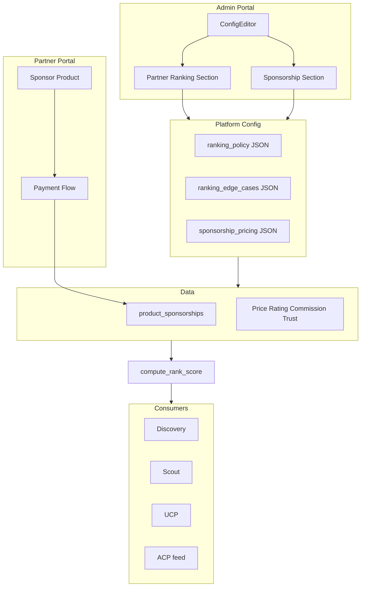

# Partner Ranking for Duplicate Products

## Current State

- **Data model**: Each product has one `partner_id`; "same" product from different partners = separate product records.
- **Search ordering**: Text search uses `created_at DESC`; semantic search uses embedding similarity only. No partner-level ranking.
- **Existing signals**: `partners.trust_score`, `partners.verification_status`; `partner_ratings.avg_rating`, `order_reviews`; `commission_breaks`; `product_inventory.quantity` (availability).

## Architecture

## Implementation Plan

### 1. Schema: Platform config for ranking policy and edge cases

**File**: New migration `supabase/migrations/YYYYMMDD_partner_ranking_config.sql`

- Add to `platform_config`:
  - `ranking_enabled` BOOLEAN DEFAULT true
  - `ranking_policy` JSONB: `{ "strategy": "weighted", "weights": { "price": 0.3, "rating": 0.3, "commission": 0.2, "trust": 0.2 }, "price_direction": "asc" }`
  - `ranking_edge_cases` JSONB: `{ "missing_rating": 0.5, "missing_commission": 0, "missing_trust": 0.5, "tie_breaker": "created_at" }`
  - `sponsorship_pricing` JSONB: `{ "product_price_per_day_cents": 1000, "max_sponsored_per_query": 3, "sponsorship_enabled": true }`
- Create `product_sponsorships` table:
  - `id`, `product_id` (FK products), `partner_id` (FK partners)
  - `start_at`, `end_at` TIMESTAMPTZ
  - `amount_cents`, `currency`, `status` (`active`, `expired`, `cancelled`)
  - `stripe_payment_intent_id` (for reconciliation)
  - `created_at`, `updated_at`

**Strategy options**: `"price"`, `"rating"`, `"commission"`, `"trust"`, `"weighted"`
**Edge-case options** (all configurable in admin):

- `missing_rating`: 0–1, default 0.5 (neutral when partner has no rating)
- `missing_commission`: 0–1, default 0
- `missing_trust`: 0–1, default 0.5
- `tie_breaker`: `"created_at"` | `"id"` | `"price"` (secondary sort when scores equal)

### 2. Admin Portal: Partner Ranking Section

**File**: [apps/portal/app/(platform)/platform/config/config-editor.tsx](apps/portal/app/(platform)/platform/config/config-editor.tsx)

Extend `ConfigEditor` with a new **Partner Ranking** section:

- **Enable ranking** toggle (`ranking_enabled`)
- **Strategy** dropdown: Price, Rating, Commission, Trust, Weighted
- **Weights** (when strategy = weighted): sliders or number inputs for price, rating, commission, trust (must sum to 1)
- **Price direction**: Ascending (cheapest first) / Descending (premium first)
- **Edge cases**:
  - Missing rating default (0–1)
  - Missing commission default (0–1)
  - Missing trust default (0–1)
  - Tie breaker (dropdown)
- **Sponsorship** section (new):
  - Enable sponsorship toggle (`sponsorship_enabled`)
  - Price per product per day (cents or USD)
  - Max sponsored products per search result (e.g. 3)
  - Optional: partner-level sponsorship (featured partner) pricing

**File**: [apps/portal/app/api/platform/config/route.ts](apps/portal/app/api/platform/config/route.ts)

- Extend GET to return `ranking_enabled`, `ranking_policy`, `ranking_edge_cases`, `sponsorship_pricing`
- Extend PATCH to accept and persist these fields

### 3. Ranking service / shared module

**File**: `packages/shared/ranking.py` (or `services/discovery-service/ranking.py`)

- `compute_product_rank_score(product, partner, partner_rating, commission_pct, config) -> float`
  - Normalize each signal to 0–1 (price: invert and scale by min/max in result set; rating: scale 1–5 to 0–1; trust: scale 0–100 to 0–1; commission: scale 0–20% to 0–1).
  - Apply weights from `config.ranking_policy`.
  - Use `config.ranking_edge_cases` for missing data (e.g. no rating → use `missing_rating`).
- `sort_products_by_rank(products, partners_map, ratings_map, commissions_map, active_sponsorships, config) -> List`
  - Join products with partner/rating/commission data, compute scores.
  - **Sponsored boost**: Products in `active_sponsorships` (where `start_at <= now < end_at`) get a configurable score boost or are placed first (up to `max_sponsored_per_query`).
  - Sort descending; tie breaker from `ranking_edge_cases.tie_breaker`.

### 4. Discovery service: apply ranking in search

**Files**:

- [services/discovery-service/db.py](services/discovery-service/db.py): `search_products` — fetch products, apply ranking, slice to limit
- [services/discovery-service/semantic_search.py](services/discovery-service/semantic_search.py): Apply ranking to semantic results
- [services/discovery-service/scout_engine.py](services/discovery-service/scout_engine.py): Ranking applied in search layer

### 5. UCP catalog and ACP feed

- **UCP**: Uses scout → products already ranked by discovery layer
- **ACP feed**: Apply same ranking when building product list

### 6. Portal products API

- Portal lists products per partner — no cross-partner duplicates. Ranking applies only for platform admin or aggregate catalog views. Add if such views exist.

### 7. Sponsored products: partner payment flow

**Partner portal** ([apps/portal/app/(partner)/products/](apps/portal/app/(partner)/products/)):

- On product list/detail: **Sponsor this product** button (visible when `sponsorship_enabled` and partner owns the product).
- Click → modal or page: choose duration (e.g. 7 days, 30 days), see price (from `sponsorship_pricing.product_price_per_day_cents * days`).
- **Pay** → calls `POST /api/partners/sponsorship/create` with `product_id`, `duration_days`.
- API creates Stripe PaymentIntent for platform (metadata: `type=sponsorship`, `product_id`, `partner_id`, `duration_days`).
- Partner completes payment via Stripe Elements (reuse [pay/page.tsx](apps/portal/app/(partner)/pay/page.tsx) pattern or dedicated sponsorship checkout).
- Webhook `payment_intent.succeeded` with `type=sponsorship` → create `product_sponsorships` row (`start_at=now`, `end_at=now + duration_days`, `status=active`).

**API** (new or extend payment service):

- `POST /api/partners/sponsorship/create` — body: `{ product_id, duration_days }`. Validates partner owns product, fetches pricing from platform_config, creates PaymentIntent, returns `client_secret`.
- `GET /api/partners/sponsorship` — list partner's active and past sponsorships.

**Discovery integration**:

- Before ranking: fetch active sponsorships for product IDs in result set (`product_sponsorships` where `start_at <= now < end_at` and `status=active`).
- Pass to `sort_products_by_rank`; sponsored products get boost or appear first (up to `max_sponsored_per_query`).

### 8. Optional: Partner-level sponsorship

- `partner_sponsorships` table: `partner_id`, `start_at`, `end_at`, `amount_cents`, `status`.
- Admin config: `partner_sponsorship_price_per_day_cents`.
- Partner portal: "Become a featured partner" — same payment flow. Ranking: featured partners' products get a secondary boost (or badge in UI).

## Key Files to Modify

| File                                                                                           | Change                                                                                   |
| ---------------------------------------------------------------------------------------------- | ---------------------------------------------------------------------------------------- |
| New migration                                                                                  | Add `ranking_*`, `sponsorship_pricing` to platform_config; create `product_sponsorships` |
| [config-editor.tsx](apps/portal/app/(platform)/platform/config/config-editor.tsx)              | Add Partner Ranking and Sponsorship sections                                             |
| [api/platform/config/route.ts](apps/portal/app/api/platform/config/route.ts)                   | Extend GET/PATCH for ranking and sponsorship fields                                      |
| `packages/shared/ranking.py` (new)                                                             | `compute_product_rank_score`, `sort_products_by_rank` (with sponsored boost)             |
| [services/discovery-service/db.py](services/discovery-service/db.py)                           | `search_products`: fetch sponsorships, apply ranking                                     |
| [services/discovery-service/semantic_search.py](services/discovery-service/semantic_search.py) | Apply ranking to semantic results                                                        |
| [services/discovery-service/api/feeds.py](services/discovery-service/api/feeds.py)             | Apply ranking when building ACP product list                                             |
| New: `apps/portal/app/api/partners/sponsorship/route.ts`                                       | POST create, GET list sponsorships                                                       |
| New: `apps/portal/app/(partner)/products/[id]/sponsor/` or modal                               | Sponsor product UI, payment flow                                                         |
| [payment-service webhook](services/payment-service/webhooks/stripe_webhook.py)                 | Handle `metadata.type=sponsorship` → create product_sponsorships                         |

## Edge Cases (Admin-Configurable)

| Edge case                  | Config key           | Default      | Description                        |
| -------------------------- | -------------------- | ------------ | ---------------------------------- |
| Partner has no rating      | `missing_rating`     | 0.5          | Neutral score for rating component |
| Partner has no commission  | `missing_commission` | 0            | No commission boost                |
| Partner has no trust_score | `missing_trust`      | 0.5          | Neutral score for trust component  |
| Tied scores                | `tie_breaker`        | `created_at` | Secondary sort field               |

## Default Config

**Ranking**:

- `ranking_enabled`: true
- `strategy`: `"weighted"`
- `weights`: `{ "price": 0.35, "rating": 0.35, "trust": 0.2, "commission": 0.1 }`
- `price_direction`: `"asc"`
- `ranking_edge_cases`: `{ "missing_rating": 0.5, "missing_commission": 0, "missing_trust": 0.5, "tie_breaker": "created_at" }`

**Sponsorship**:

- `sponsorship_pricing`: `{ "sponsorship_enabled": true, "product_price_per_day_cents": 1000, "max_sponsored_per_query": 3 }`

