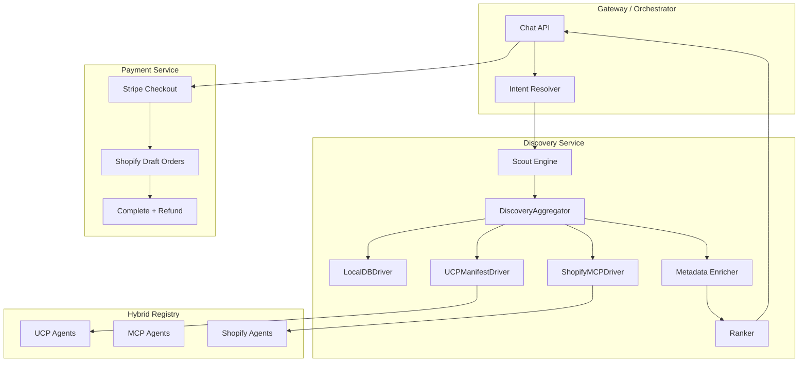

# Shopify MCP Integration and Curated Partner Mesh

## Resolved Decisions

| Question | Decision |
|----------|----------|
| LLM for enrichment | Use existing configured LLM (Platform Config / `llm_provider`); no new model |
| Gateway results | Return progressively (streaming) as each driver completes |
| Shopify credential storage | Supabase Vault |
| Price premium | Admin-configurable `price_premium_percent` per partner; default 0 |
| METADATA_ENRICHMENT_MODEL | Not needed; use existing LLM config |

---

## Current State Summary

- **Registry**: `internal_agent_registry` (base_url, display_name, capability, enabled); no transport type
- **Discovery**: [packages/shared/discovery_aggregator.py](packages/shared/discovery_aggregator.py) - LocalDBDriver, UCPManifestDriver, MCPDriver (placeholder); parallel via `asyncio.gather`, 5s timeout
- **Masking**: [services/discovery-service/db.py](services/discovery-service/db.py) - `uso_` + random 24 chars; `id_masking_map` stores mapping
- **Data hygiene**: [packages/shared/ucp_public_product.py](packages/shared/ucp_public_product.py) - strips `experience_tags`, `partner_id`, `internal_notes`; `STRIP_KEYS` - add `raw_shopify_variant_ids` if needed
- **Orders**: `order_legs` has status (pending); `bundle_legs` has leg_type; no `experience_session` tables
- **Payment**: Stripe Checkout (redirect); no Shopify Draft Order integration

---

## Phase 1: Hybrid Registry and Admin Onboarding

### 1.1 Schema Migration

**New migration** (e.g. `20250129000000_hybrid_registry_shopify.sql`):

- Add to `internal_agent_registry`:
  - `transport_type TEXT NOT NULL DEFAULT 'UCP'` (values: `UCP`, `MCP`, `SHOPIFY`)
  - `available_to_customize BOOLEAN DEFAULT false`
  - `metadata JSONB` (for shop_url, mcp_endpoint, capabilities when transport=SHOPIFY)
- Add index on `transport_type`

**New table** `shopify_curated_partners`:

- `partner_id UUID REFERENCES partners(id)`
- `shop_url TEXT NOT NULL` (e.g. mikesbikes.com)
- `access_token` stored via Supabase Vault (secret reference)
- `mcp_endpoint TEXT` (e.g. https://mikesbikes.com/api/mcp)
- `supported_capabilities JSONB` (e.g. ["search_shop_catalog", "get_product_details"])
- `internal_agent_registry_id UUID` (links to registry row)
- `price_premium_percent DECIMAL(5,2) DEFAULT 0` (admin-configurable markup per partner; 0 = no premium)

### 1.2 Admin API

**New endpoint** `PUT /api/v1/admin/partners` in [services/discovery-service/api/admin.py](services/discovery-service/api/admin.py):

- Body: `shop_url`, `access_token`, `mcp_endpoint`, `supported_capabilities`, `display_name`, `available_to_customize`, `price_premium_percent` (optional, default 0)
- Logic: Create/update `partners` row, create/update `internal_agent_registry` with `transport_type=SHOPIFY`, store token in Supabase Vault and reference in `shopify_curated_partners`
- Require admin auth (existing auth middleware)

### 1.3 Registry Driver

**Refactor** [services/orchestrator-service/registry.py](services/orchestrator-service/registry.py) and [services/discovery-service/db.py](services/discovery-service/db.py):

- `get_active_agents(capability)` returns structured `HybridRegistry`:
  - `ucp_agents: List[AgentEntry]`
  - `mcp_agents: List[AgentEntry]`
  - `shopify_agents: List[ShopifyAgentEntry]` (includes mcp_endpoint, slug, price_premium_percent)
- `get_internal_agent_urls()` stays for UCP; add `get_shopify_mcp_endpoints(capability)` for MCP driver

---

## Phase 2: Asynchronous MCP Scout and ShopifyMCPDriver

### 2.1 ShopifyMCPDriver

**New file** `packages/shared/shopify_mcp_driver.py` (or `services/discovery-service/drivers/shopify_mcp.py`):

- `ShopifyMCPDriver(get_shopify_endpoints: Callable)`
- `search(query, limit)` → For each endpoint, POST JSON-RPC: `{"jsonrpc":"2.0","method":"tools/call","params":{"name":"search_shop_catalog","arguments":{"query":query,"filters":[{"available":true}]}},"id":1}`
- Parse response; map to `UCPProduct` (id, title, price, image_url, description)
- **Timeout: 3 seconds per request** (httpx timeout=3.0)
- Use `asyncio.gather(..., return_exceptions=True)` to fan out to all Shopify MCP endpoints in parallel

**Shopify product → UCP Item mapping**:

- `id` → use `shopify_{shop_slug}_{variant_id}` or `gid` as external id (before masking)
- `title` → product title
- `price` → variant price × (1 + `price_premium_percent` / 100); apply partner's `price_premium_percent`; 0 = no markup
- `image_url` → first image src
- `description` → body_html or description

### 2.2 Scout Engine Refactor

**Update** [services/discovery-service/scout_engine.py](services/discovery-service/scout_engine.py):

- Replace single `_fetch_via_aggregator` call with true parallel broadcast
- LocalDBDriver, UCPManifestDriver, ShopifyMCPDriver all receive same intent
- `DiscoveryAggregator` timeout: 3 seconds (configurable)
- **Streaming/progressive results**: Emit results as each driver returns (per Resolved Decisions)

**Update** [packages/shared/discovery_aggregator.py](packages/shared/discovery_aggregator.py):

- Add `ShopifyMCPDriver` to constructor
- Pass `get_shopify_mcp_endpoints` from Discovery service (reads `shopify_curated_partners` + `internal_agent_registry`)
- Emit results incrementally to Gateway as each driver completes

---

## Phase 3: Dynamic Metadata Enricher (Experience Tags)

### 3.1 Enrichment Middleware

**New file** `services/discovery-service/middleware/metadata_enricher.py`:

- Intercept products before they reach the ranker (in scout_engine or products API)
- If `experience_tags` is missing or empty and product has `description`:
  - Call **existing configured LLM** (Platform Config / `llm_provider`); no new model or env var
  - Prompt: "Given this product description, return 1-5 experience tags from: luxury, romantic, baby, celebration, travel, night_out, family, etc."
  - Parse response; assign `experience_tags: ["tag1","tag2"]` to product
- **Caching**: Store enriched tags in `products.experience_tags` or a cache keyed by product id to avoid repeat LLM calls
- **Config**: Optional `METADATA_ENRICHMENT_ENABLED` (default true) to toggle; no separate model config
- Guard: Skip if product is from external source (Shopify MCP) and we don't persist to DB — enrich in-memory only for ranking

### 3.2 Integration Point

- In [services/discovery-service/scout_engine.py](services/discovery-service/scout_engine.py), after `_fetch_via_aggregator` returns and before `_apply_ranking`, run enrichment on products missing `experience_tags`
- For Shopify products (source=SHOPIFY), enrichment is in-memory; don't write back to DB (no `products` row)

---

## Phase 4: Seller of Record Masking and Experience Session

### 4.1 Masking Layer

**Update** [services/discovery-service/db.py](services/discovery-service/db.py):

- Change `_mask_id_insert` to accept `agent_slug: Optional[str]`
- New format when slug provided: `uso_{agent_slug}_{original_id}` (sanitize original_id to alphanumeric)
- Update `mask_products` to pass `agent_slug` from registry (via product's `partner_id` → lookup slug, or from driver metadata)
- `id_masking_map`: add `agent_slug` column for resolution
- `resolve_masked_id`: support both formats (legacy `uso_<uuid>` and new `uso_<slug>_<id>`)

### 4.2 Experience Session and Legs

**New migration** `20250129000001_experience_sessions.sql`:

```sql
CREATE TABLE experience_sessions (
  id UUID PRIMARY KEY DEFAULT gen_random_uuid(),
  thread_id TEXT NOT NULL,
  user_id UUID REFERENCES users(id),
  status TEXT DEFAULT 'active',
  created_at TIMESTAMPTZ DEFAULT NOW(),
  updated_at TIMESTAMPTZ DEFAULT NOW()
);

CREATE TABLE experience_session_legs (
  id UUID PRIMARY KEY DEFAULT gen_random_uuid(),
  experience_session_id UUID REFERENCES experience_sessions(id),
  partner_id UUID REFERENCES partners(id),
  product_id TEXT,
  status TEXT NOT NULL DEFAULT 'pending',
  shopify_draft_order_id TEXT,
  created_at TIMESTAMPTZ DEFAULT NOW(),
  updated_at TIMESTAMPTZ DEFAULT NOW()
);

CREATE TABLE experience_session_leg_overrides (
  id UUID PRIMARY KEY DEFAULT gen_random_uuid(),
  leg_id UUID REFERENCES experience_session_legs(id),
  admin_id UUID NOT NULL,
  old_status TEXT NOT NULL,
  new_status TEXT NOT NULL,
  created_at TIMESTAMPTZ DEFAULT NOW()
);
```

**State machine**:

- `pending` → discovery not yet matched
- `ready` → discovery match; show "Add to Bundle"
- `in_customization` → design chat started (e.g. "Partner is designing your letter")
- `committed` → payment success; triggers Shopify complete

**Persistence for WhatsApp/SMS**: Store `thread_id` and `experience_session_id` in conversation/thread metadata; look up on resume.

### 4.3 API Hooks

- When discovery returns products and user adds to bundle → create/update `experience_session_legs` with status `ready`
- When customization starts (e.g. design chat) → update leg to `in_customization`
- When payment completes → update leg to `committed`; trigger Shopify settlement

### 4.4 User-Facing View

- **Chat/assistant UI**: Show Experience Session summary and Legs to the user
  - Add `experience_session` and `experience_session_legs` as data parts in [apps/assistant-ui-chat/components/GatewayPartRenderers.tsx](apps/assistant-ui-chat/components/GatewayPartRenderers.tsx)
  - Render: session status, each leg with partner name, product, status (ready / in_customization / committed)
  - User sees: "BMW leg: ready" / "Bakery leg: designing your letter..."
- **API**: `GET /api/v1/experience-sessions/{id}` and `GET /api/v1/experience-sessions/{id}/legs` (or embedded) for the chat client

### 4.5 Admin Console

- **Portal page**: `apps/portal/app/(platform)/platform/experience-sessions/page.tsx`; add nav entry in [components/platform-nav.tsx](apps/portal/components/platform-nav.tsx)
  - List all experience sessions (filter by thread_id, user_id, status, date)
  - Drill into session: show legs with partner, product, status, timestamps
  - Link to related order/bundle when committed
- **API**: `GET /api/platform/experience-sessions`, `GET /api/platform/experience-sessions/[id]` (admin auth)

### 4.6 Manual Overrides

- **Admin API**: `PATCH /api/platform/experience-session-legs/[id]` with body `{ "status": "ready" | "in_customization" | "committed" }`
  - Allows admin to manually set leg status (e.g. force "committed" if Shopify complete failed but order was fulfilled manually)
  - Audit: insert row into `experience_session_leg_overrides` (admin_id, old_status, new_status, created_at)
- **Portal UI**: On session detail page, add "Override status" dropdown per leg with Save button; confirm before applying

### 4.7 Partner Messaging and Reminders

- **Send messages to partners**: From the Experience Session detail page, admin can send a message to the partner(s) for a given leg
  - API: `POST /api/platform/experience-session-legs/[id]/message` with body `{ "message": "...", "channel": "email" | "in_app" }`
  - Backend: Use existing notification/email infra; store in `partner_messages` or `notifications` table
- **Reminders**: Admin can schedule or trigger a reminder to the partner
  - API: `POST /api/platform/experience-session-legs/[id]/remind` with optional `{ "delay_hours": 24 }`
  - Backend: Create scheduled task (task-queue or cron) to send reminder; or send immediately with "reminder" flag
- **Portal UI**: Per-leg actions: "Send message" button (opens modal with text area); "Send reminder" button (optional delay picker)

---

## Phase 5: Payment Workflow (Gateway-to-Shopify)

### 5.1 Standardized Shipping Object

**New schema** in Discovery or Payment service:

```python
class StandardizedShipping(BaseModel):
    name: str
    address: Dict  # street_address, locality, region, postal_code, country
    phone: Optional[str]
    email: str
```

- Collect at Gateway (checkout form) before payment
- Pass to Draft Order creation

### 5.2 Draft Order Pre-Check

**New module** `services/payment-service/shopify_draft.py`:

- `create_draft_order_precheck(shop_url, access_token, line_items, shipping_address) → DraftOrderResponse`
  - Call Shopify Admin REST: `POST /admin/api/2024-10/draft_orders.json` with line_items, shipping_address
  - Set `status: "draft"` — do not complete
  - Return `total_price`, `total_tax`, `total_shipping`, `currency`
- Use this to show user **exact TCO** before charging

### 5.3 Payment Flow

1. **Collection**: User enters shipping; Gateway calls Draft Order pre-check → receives tax+shipping
2. **Display**: Show final TCO (subtotal + tax + shipping)
3. **Charge**: Gateway charges user via Stripe for total amount
4. **Settlement**: On success, call Shopify `complete` endpoint (REST: `PUT /admin/api/2024-10/draft_orders/{id}/complete.json` with `payment_pending: false` and mark as paid)
5. **Error handling**: If `complete` returns "Out of Stock" or similar:
   - Trigger partial refund via Stripe
   - Update `experience_session_legs` status (e.g. `failed`)
   - Notify user via status

### 5.4 Soft-Reserve Check

- Before calling complete, optionally verify inventory via Shopify Inventory API
- Implement retry or graceful degradation if complete fails

---

## Phase 6: Data Hygiene

### 6.1 Strip Additional Fields

**Update** [packages/shared/ucp_public_product.py](packages/shared/ucp_public_product.py):

- Add `raw_shopify_variant_ids` to `STRIP_KEYS` (if such a key is ever added)
- Ensure `experience_tags`, `internal_notes` remain in `STRIP_KEYS` (already present)
- Apply `filter_product_for_public` in all public product responses (UCP items, discover, gateway proxy)

### 6.2 Audit Response Paths

- [services/discovery-service/api/products.py](services/discovery-service/api/products.py): `_product_for_public_response` — already uses `filter_product_for_public`
- [services/discovery-service/api/ucp.py](services/discovery-service/api/ucp.py): `_product_to_ucp_item` — uses `filter_product_for_public`
- Gateway proxy responses — ensure all product payloads go through the same filter

---

## Architecture Diagram



---

## Dependencies and Order

| Phase | Depends On | Deliverables |
|-------|------------|--------------|
| 1 | — | Migration, Admin API, Hybrid Registry |
| 2 | 1 | ShopifyMCPDriver, Scout refactor, 3s timeout, streaming |
| 3 | — | Metadata enricher middleware |
| 4 | 1 | Masking update, experience_session_legs, user view, admin, overrides, messaging |
| 5 | 1, 4 | StandardizedShipping, Draft Order pre-check, settlement, refund handling |
| 6 | — | STRIP_KEYS, audit |

Phases 1, 3, 6 can be done in parallel. Phase 2 depends on 1. Phase 4 depends on 1. Phase 5 depends on 1 and 4.

---

## Configuration / Environment

- `SHOPIFY_MCP_TIMEOUT_SEC=3`
- `METADATA_ENRICHMENT_ENABLED` (optional, default true) — toggle enrichment; LLM uses existing Platform Config
- Shopify partner tokens: Supabase Vault (no separate env key; Vault handles secrets)

---

## Credential Storage: Supabase Vault

- Store Shopify `access_token` in Supabase Vault (secret reference)
- Admin API writes secret via Vault API; runtime reads via Vault
- See [Supabase Vault documentation](https://supabase.com/docs/guides/database/vault) for pg_net and secrets management
