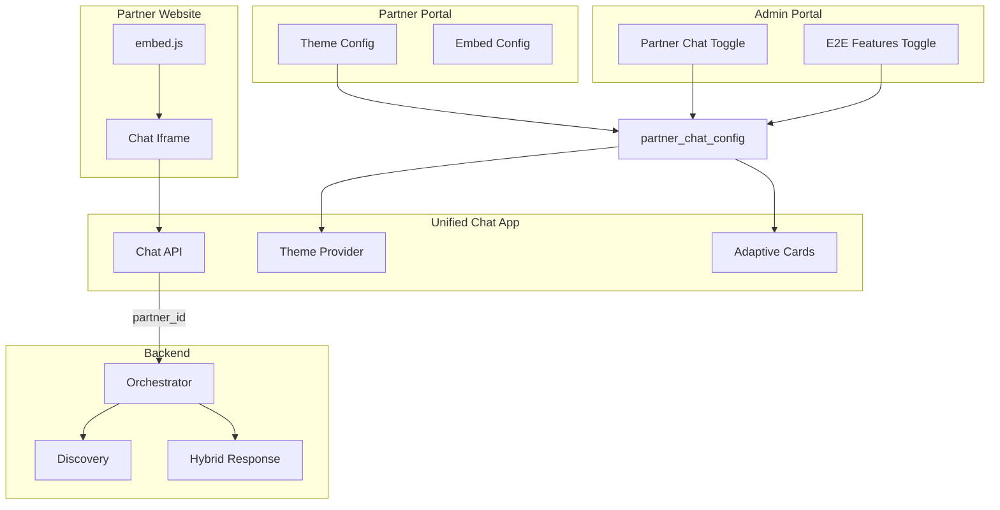

# Unified Chat E2E with Partner Embed and Admin Control

## Goals

1. **Full E2E flow**: Discover, add to bundle, checkout, payment within the web app.
2. **Partner-embeddable**: Chat widget can be embedded on partner websites.
3. **White-label**: Look and feel configurable to match partner's website (colors, fonts, logo).
4. **Partner-scoped**: When embedded, chat answers from partner's products, services, KB, FAQ only.
5. **Admin control**: Admin portal controls whether each partner's chat shows E2E features (add to bundle, checkout, payment).
6. **Futuristic UI**: Class-leading chat interface with animations (Gemini/ChatGPT level).

---

## Part A: End-to-End Functionality (Platform Chat)

Same as prior plan: Adaptive Card rendering, bundle state, API proxies, payment flow. See [unified_chat_e2e_and_futuristic_ui](#) for details.

---

## Part B: Partner-Scoped Chat

### B1. Chat API with partner_id

**Orchestrator** `POST /api/v1/chat` already accepts optional params. Extend:

- `partner_id` (optional): When set, discovery is filtered to that partner's products only.
- `include_kb_faq` (optional): When true and partner_id set, inject partner KB/FAQs into context for support-style queries.

**Discovery service**: `search_products` and scout already support `partner_id` filter.

**Intent + Discovery flow**: When `partner_id` is present, pass it to `discover_products`. For KB/FAQ: either (a) call Hybrid Response service to answer from KB/FAQs when intent is support-like, or (b) include KB/FAQ snippets in a pre-prompt for the chat response.

### B2. KB and FAQ Integration

**Existing**: `partner_kb_articles`, `partner_faqs` tables; Hybrid Response service has `fetch_kb_and_faqs`, `create_classification_and_respond`.

**Options**:

- **Option A**: Chat API detects support/FAQ intent → calls Hybrid Response → returns KB/FAQ answer.
- **Option B**: Chat API always receives partner KB/FAQ as context when partner_id set; LLM uses it for any query.

**Recommendation**: Option A for cleaner separation. Add `classify_support`-style routing: if user asks "what's your return policy" or similar, call Hybrid Response with partner_id; else do product discovery.

---

## Part C: Partner Theme and Embed Configuration

### C1. Schema: partner_chat_config

**New migration** `supabase/migrations/YYYYMMDD_partner_chat_config.sql`:

```sql
CREATE TABLE partner_chat_config (
  id UUID PRIMARY KEY DEFAULT gen_random_uuid(),
  partner_id UUID NOT NULL REFERENCES partners(id) ON DELETE CASCADE UNIQUE,
  -- Theme / branding
  primary_color VARCHAR(7) DEFAULT '#1976d2',
  secondary_color VARCHAR(7) DEFAULT '#424242',
  font_family VARCHAR(100) DEFAULT 'Inter, sans-serif',
  logo_url TEXT,
  welcome_message TEXT DEFAULT 'How can I help you today?',
  -- Embed
  embed_enabled BOOLEAN DEFAULT FALSE,
  embed_domains JSONB DEFAULT '[]',  -- Allowed origins for embed
  -- Feature flags (can be overridden by admin)
  e2e_add_to_bundle BOOLEAN DEFAULT TRUE,
  e2e_checkout BOOLEAN DEFAULT TRUE,
  e2e_payment BOOLEAN DEFAULT TRUE,
  created_at TIMESTAMPTZ DEFAULT NOW(),
  updated_at TIMESTAMPTZ DEFAULT NOW()
);
```

### C2. Admin Override: platform-level control

**Extend** `platform_config` or add `partner_chat_admin`:

- Admin can set per-partner: `chat_widget_enabled`, `e2e_features_enabled`.
- When `e2e_features_enabled` = false, partner's chat hides Add to Bundle, Checkout, Payment (discovery-only).

**Alternative**: Store in `partner_chat_config` with admin-only editable fields: `admin_e2e_enabled` (admin override). Partner config is default; admin can disable.

### C3. Partner Portal: Chat Widget Settings

**New page**: `apps/portal/app/(partner)/settings/chat-widget/page.tsx`

- **Theme**: Color pickers (primary, secondary), font selector, logo upload.
- **Welcome message**: Text input.
- **Embed**: Toggle enable, add allowed domains. Show embed code snippet:
  ```html
  <script src="https://uso-unified-chat.vercel.app/embed.js" data-partner-id="PARTNER_UUID"></script>
  ```
- **Preview**: Live preview of chat with current theme.

### C4. Embeddable Widget

**New**: `apps/uso-unified-chat/app/embed/` or separate route

- **Embed script** (`public/embed.js` or `/embed.js`): Lightweight loader that injects iframe or inline chat.
- **Query params / data attributes**: `data-partner-id`, `data-theme` (or fetch from API by partner_id).
- **CORS / domain allowlist**: Validate `embed_domains` when chat loads; reject if origin not allowed.
- **Theme injection**: Apply `partner_chat_config` (colors, font) via CSS variables or inline styles.

---

## Part D: Admin Portal Control

### D1. Admin: Partner Chat Settings

**New section** in Admin Portal (or extend partner edit):

- **Partner list** with columns: Chat enabled, E2E enabled.
- **Per-partner edit**: Toggle "Chat widget enabled", "E2E features (add to bundle, checkout, payment)".
- **Bulk actions**: Enable/disable chat for multiple partners.

**API**: `PATCH /api/platform/partners/[id]/chat-config` — admin-only. Updates `partner_chat_config` or a separate admin override table.

### D2. Feature Flag Behavior


| Admin setting | Effect                                                                |
| ------------- | --------------------------------------------------------------------- |
| Chat disabled | Partner's embed script returns 403 or shows "Chat unavailable"        |
| E2E disabled  | Chat shows products only; no Add to Bundle, Checkout, Payment buttons |
| E2E enabled   | Full flow: add to bundle, checkout, payment                           |


---

## Part E: Futuristic UI (Platform + Embed)

- Full-height chat layout, message bubbles, typing indicator.
- Framer Motion: message entrance, hover effects.
- Tailwind CSS for styling.
- **Theme override**: When `partner_chat_config` is loaded (embed mode), apply `primary_color`, `secondary_color`, `font_family` via CSS variables. Platform chat uses default theme.

---

## Architecture




---

## Implementation Order

1. E2E core (Adaptive Cards, bundle, checkout, payment)
2. Futuristic UI (layout, animations)
3. Schema: `partner_chat_config`
4. Chat API: accept `partner_id`, filter products, KB/FAQ integration
5. Partner portal: Chat Widget Settings page (theme, embed code)
6. Embeddable widget (script, iframe, theme injection)
7. Admin portal: Partner chat control (enable, E2E toggle)
8. Domain allowlist and CORS for embed

---

## Key Files


| File                                                              | Purpose                                                    |
| ----------------------------------------------------------------- | ---------------------------------------------------------- |
| `supabase/migrations/YYYYMMDD_partner_chat_config.sql`            | partner_chat_config table                                  |
| `apps/portal/app/(partner)/settings/chat-widget/page.tsx`         | Partner theme + embed config                               |
| `apps/portal/app/api/platform/partners/[id]/chat-config/route.ts` | Admin update partner chat                                  |
| `apps/uso-unified-chat/app/embed/` or `embed.js`                  | Embeddable widget                                          |
| `apps/uso-unified-chat/app/api/chat/route.ts`                     | Accept partner_id, fetch theme                             |
| `apps/uso-unified-chat/components/ThemeProvider.tsx`              | Apply partner theme from config                            |
| Orchestrator chat                                                 | Accept partner_id, pass to discovery; optional KB/FAQ call |


